# Power BI Embedded Hands On Lab

### Overall Estimated Duration: 4 hours

## Overview

Power BI Embedded enables you to seamlessly integrate interactive Power BI reports and dashboards into your applications, providing rich data visualization experiences for your users. With capabilities to create, embed, and customize Power BI content, this service helps organizations enhance decision-making processes and deliver actionable insights. By leveraging Power BI Embedded, you can enable scalable, secure, and cost-effective analytics solutions tailored to your business needs, fostering innovation and improving operational efficiency.

This lab provides hands-on experience with Power BI Embedded, guiding participants through the process of integrating interactive Power BI reports and dashboards into custom applications. Through step-by-step exercises, you will learn how to embed and configure Power BI content using the App Owns Data model. The lab also covers key features such as natural language queries (Q&A), data export, and row-level security (RLS) to deliver personalized and secure analytics experiences. By the end of this lab, you will be equipped with the skills to build scalable and interactive reporting solutions that enhance data-driven decision-making within your applications.

## Objective

By the end of this lab, you will be able to:

- **Embed Power BI reports:** Integrate reports into a web application using the App Owns Data model with service principal authentication.

- **Enable natural language queries:** Embed the Q&A visual to allow users to interact with data using natural language.

- **Export report data:** Configure export options to allow users to download visual data as CSV files.

- **Apply row-level security (RLS):** Implement RLS to restrict data access based on user roles for secure, personalized reporting.

## Prerequisites

- Basic understanding of Power BI and the Power BI Service
- Familiarity with Power BI workspace concepts and report publishing
- Working knowledge of Visual Studio Code and editing JSON/C# files
- Experience using Power Query and data transformation techniques
- Foundational knowledge of authentication concepts

## Architechture

The architecture for integrating **Power BI Embedded** into applications involves using the **Power BI Embedded** service, which allows embedding **Power BI** reports and dashboards within your application. The reports are created and stored in the **Power BI service**, and authentication is managed via **Azure Active Directory (Azure AD)** to ensure secure access. A client application communicates with **Power BI** using the **Power BI REST API** to embed reports and handle user interactions. The application displays these reports seamlessly, enabling users to explore and interact with the embedded data. This architecture leverages **Azure's cloud capabilities** to deliver scalable, interactive data visualizations within custom applications.

## Architechture Diagram

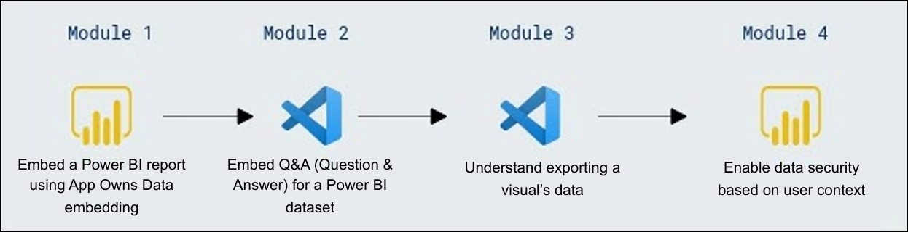

## Explanation of Components

The architecture for this lab involves several key components:

- **Power BI Embedded Service**: Allows the integration of Power BI reports and dashboards into custom applications, enabling users to view interactive reports directly within the app.
- **Power BI Reports and Dashboards**: The visualizations and data insights created in Power BI that can be embedded into external applications.
- **Azure Active Directory (AAD)**: Provides identity and access management, ensuring secure authentication and authorization for Power BI Embedded users.
- **Power BI REST API**: A set of web services that allows developers to interact with Power BI resources, enabling the embedding of reports, management of user access, and more.
- **Power BI Workspace**: A container within Power BI for organizing and managing reports and datasets, which can be shared or embedded into other applications.


## Getting Started with Lab

Welcome to your Power BI Embedded Hands-On Lab! This lab is designed to give you practical experience with embedding Power BI reports and dashboards into your applications. Let's get started and explore how you can integrate Power BI into your solutions.

## Accessing Your Lab Environment
 
Once you're ready to dive in, your virtual machine and lab guide will be right at your fingertips within your web browser.

   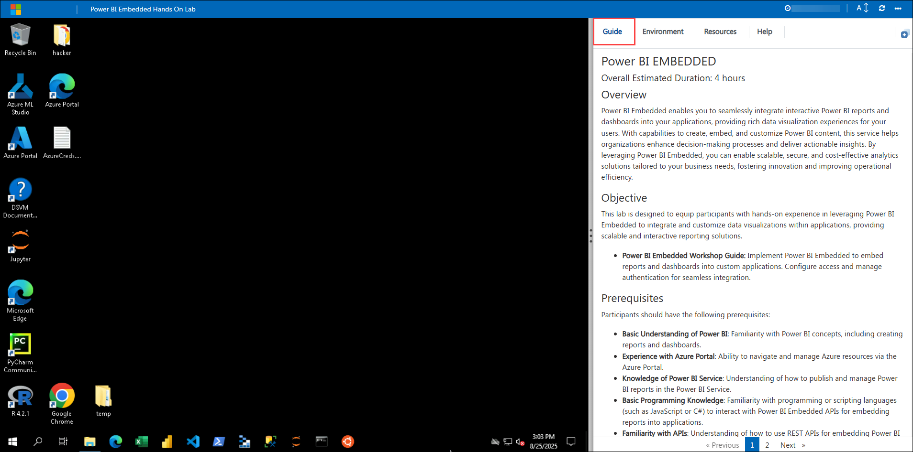
 
## Virtual Machine & Lab Guide

Your virtual machine is your workhorse throughout the workshop. The lab guide is your roadmap to success.

## Exploring Your Lab Resources
 
To get a better understanding of your lab resources and credentials, navigate to the **Environment** tab. Here, you will find the Azure credentials. Click on the **Environment** option to verify the credentials.
 
   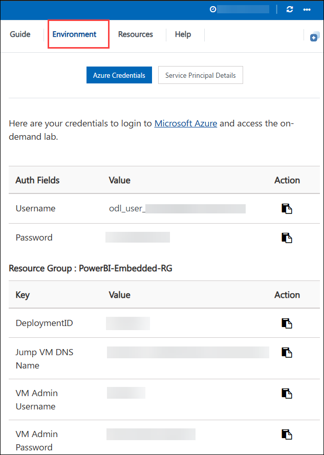

## Utilizing the Split Window Feature
 
For convenience, you can open the lab guide in a separate window by selecting the **Split Window** button from the Top right corner.
 
   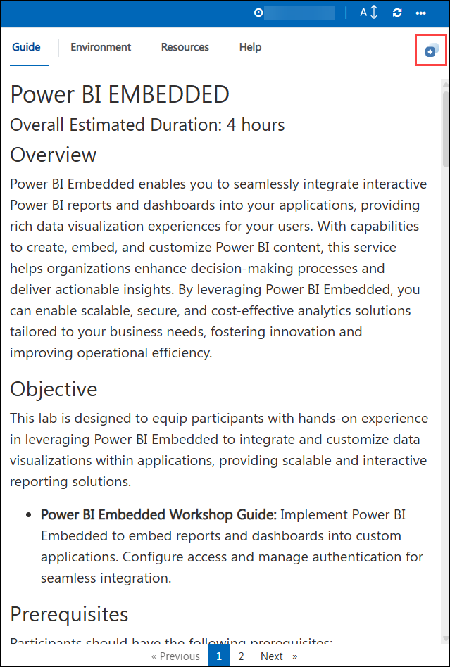

## Managing Your Virtual Machine
 
Feel free to **start, stop**, or **restart** your virtual machine as needed from the **Resources** tab. Your experience is in your hands!

   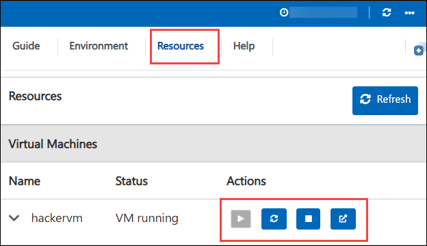

## Lab Guide Zoom In/Zoom Out
 
To adjust the zoom level for the environment page, click the **A↕ : 100%** icon located next to the timer in the lab environment.

   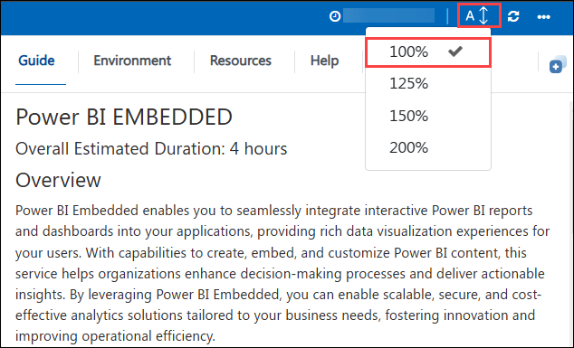

## Let's Get Started with Power BI Portal

1. If you see the **Microsoft Teams** window, click the **X** button at the top-right corner to close it.

    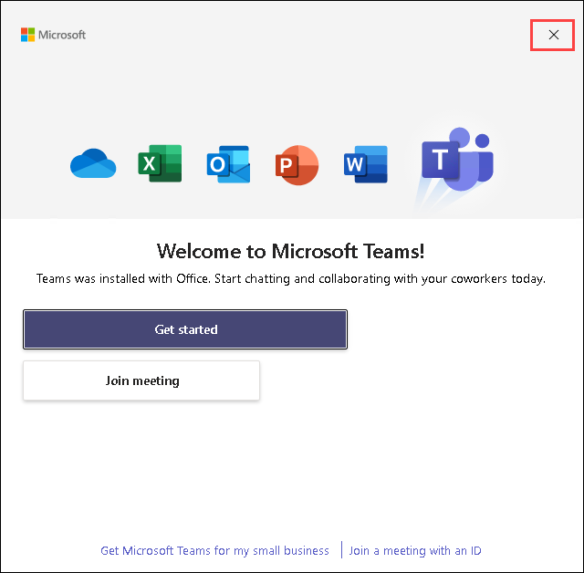

1. On the Lab VM, open **Microsoft Edge** from the desktop. In a new tab, navigate to **Power Bi** portal by copying and pasting the following URL into the address bar:

   ```
   https://app.powerbi.com/
   ```

    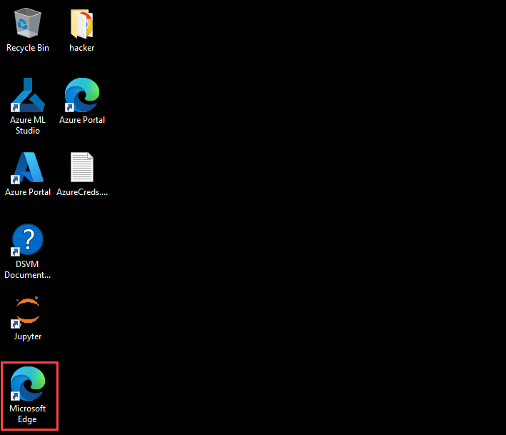

2. On the **Enter your email, we'll check if you need to create a new account** tab, you will see the login screen, in that enter the following email/username, and click on **Submit (2)**.
 
   - **Email/Username:** <inject key="AzureAdUserEmail"></inject> **(1)**
 
      

3. Now enter the following password and click on **Sign in (2)**.
 
   - **Password:** <inject key="AzureAdUserPassword"></inject> **(1)**
 
      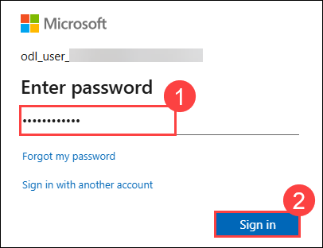
     
1. If you see the pop-up **Stay Signed in?**, select **No**.

    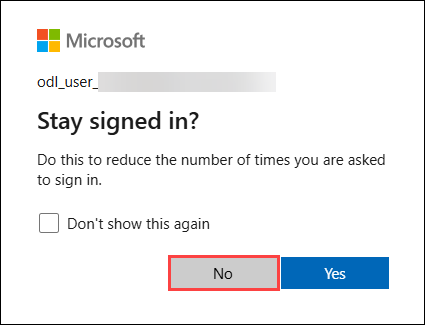

1. You should be able to view the Power BI Portal.

    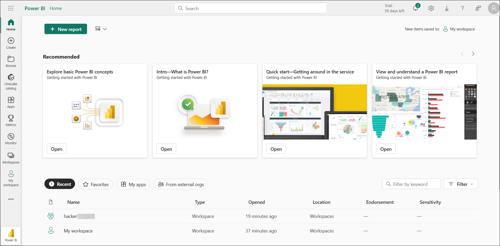

1. From the left navigation pane, click **Workspaces (1)**, then select the pre-created workspace **hacker<inject key="DeploymentID" enableCopy="false" />** **(2)**.

    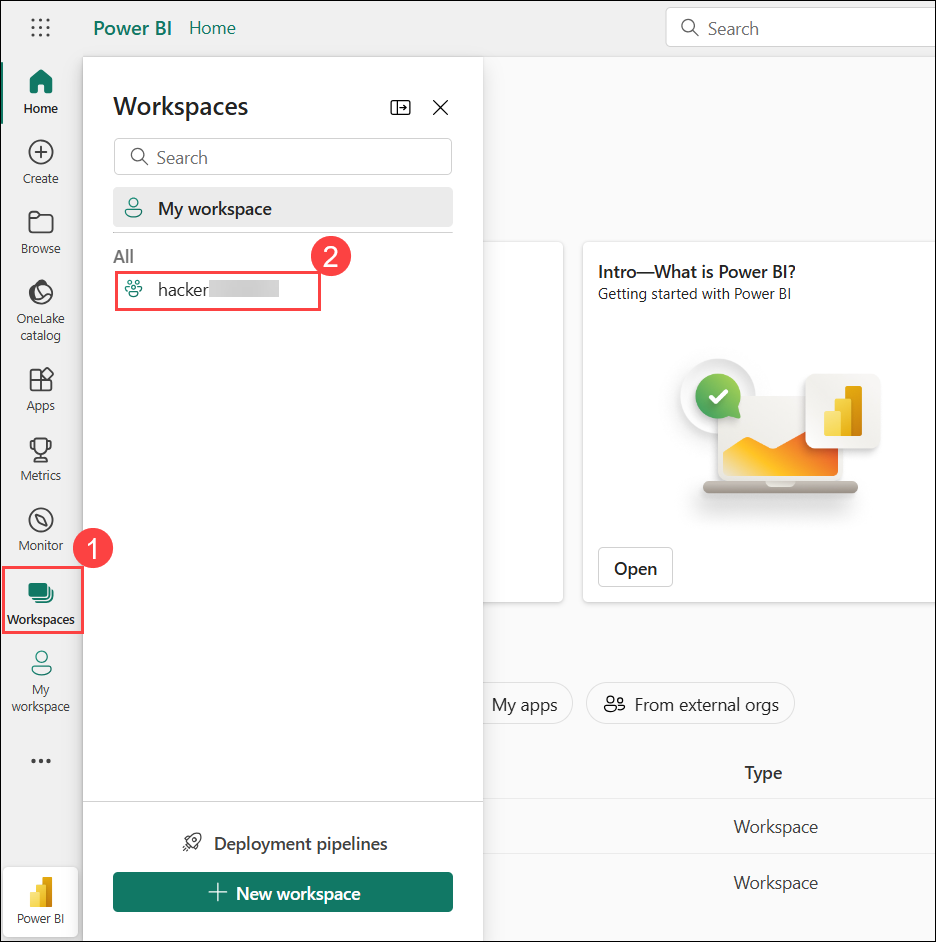

1. You'll be able to visualize the **Wingtip Sales Analysis** report and semantic model uploaded in the workspace.

    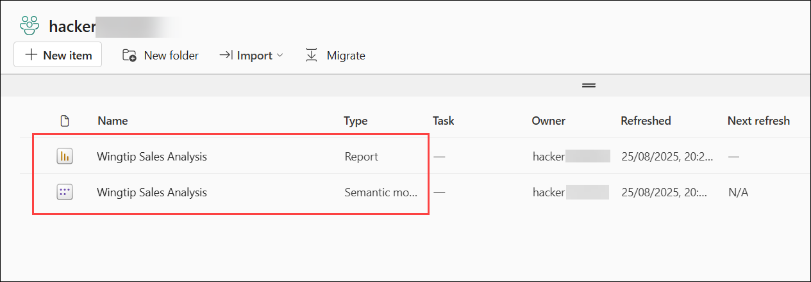

1. From Power BI home page, Click on the **Settings (1)** icon at the top and select **Admin portal (2)**.

    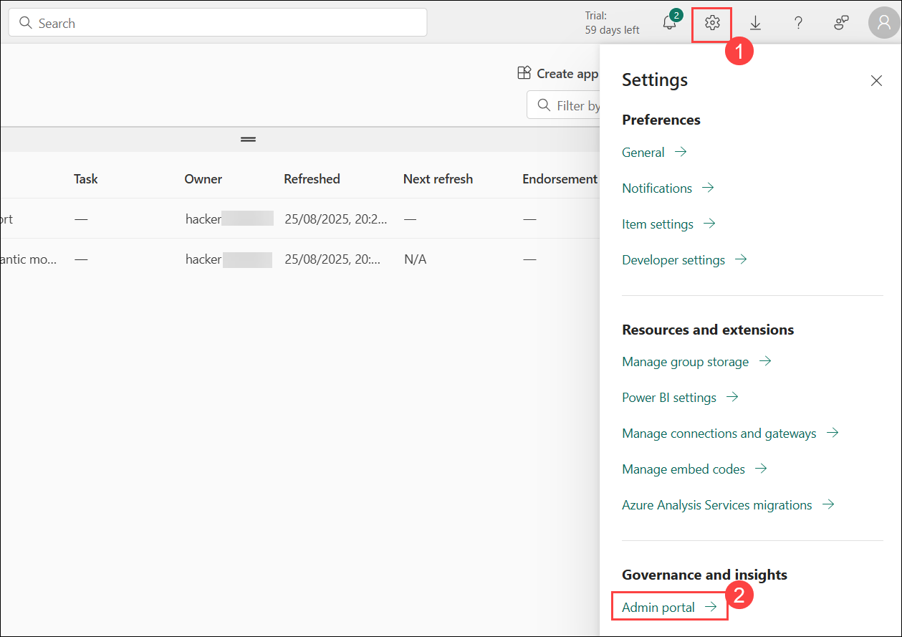

1. Scroll down to Developer settings. If **Service principals can use Fabric APIs** is not **enabled**, toggle it **on (1)**. Under **Apply to** section, select **Specific security groups (2)**, search and select **PowerbiSDP (3)**, then click **Apply (4)** to save the changes.

    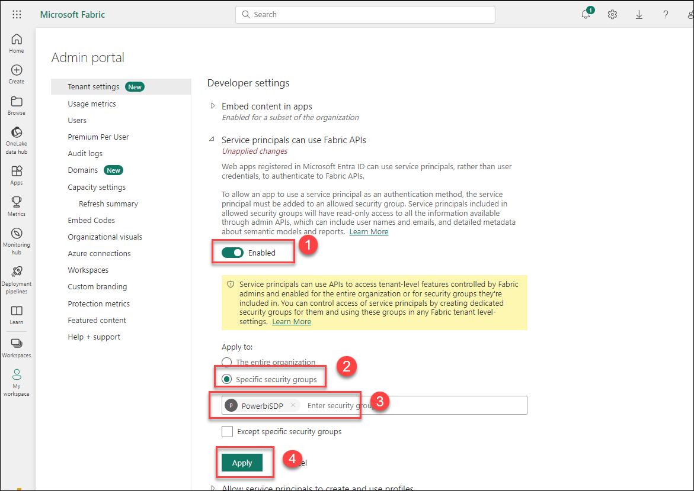
   
    

      >**Note** : Please proceed if the **PowerbiSDP** security group is already applied.

1. Scroll down to Admin API settings. If **Service principals can access read-only Admin APIs** is not already **enabled**, toggle it **on (1)**. Under the **Apply to** section, select **Specific security groups (2)**, search and select **PowerbiSDP (3)**, then click **Apply (4)** to save the changes.

    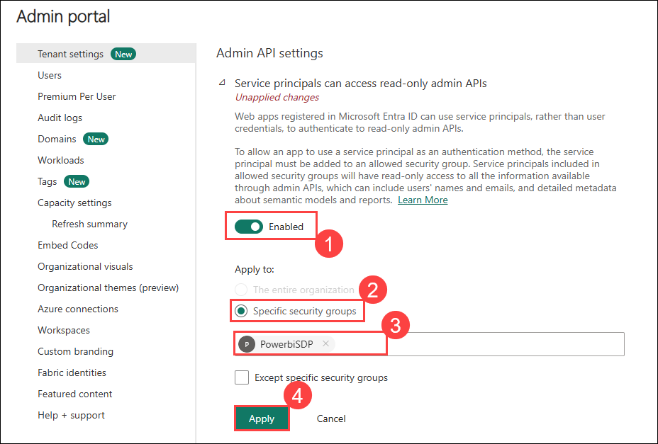

      >**Note** : Please proceed if the **PowerbiSDP** security group is already applied.

## Support Contact

The CloudLabs support team is available 24/7, 365 days a year, via email and live chat to ensure seamless assistance at any time. We offer dedicated support channels tailored specifically for both learners and instructors, ensuring that all your needs are promptly and efficiently addressed.

Learner Support Contacts:

- Email Support: cloudlabs-support@spektrasystems.com
- Live Chat Support: https://cloudlabs.ai/labs-support

Now, click on **Next >>** from the lower right corner to move on to the next page.
   


## Happy Learning!!
