# Power BI Embedded Workshop Guide

## Outcome

At the end of this workshop, you will learn how to –
1. Module 1: Embed a Power BI report using App Owns Data embedding
1. Module 2: Embed Q&A (Question & Answer) for a Power BI dataset
1. Module 3: Understand exporting a visual’s data 
1. Module 4: Enable data security based on user context

## Getting started
1. Open the App Owns Data sample code from your desktop

1. Open the sample in VS Code and run the sample as is

Files to be updated while completing the modules

1. /appsettings.json
1. /wwwroot/js/index.js
1. /Services/PBIEmbedService.cs

## Hands-on

### Module 1: Embedding Your First Power BI report

1. Login to your virtual machine with the username and password provided (hacker1/password).

1. Open up a browser and login to powerbi.com with the user and password provided (i.e. 
hacker1@ /password)

1. Find the workspace related to your hacker# (i.e. hacker1, hacker2, … hackerXX, etc.) and locate
the “Wingtip Sales Analysis” report.

   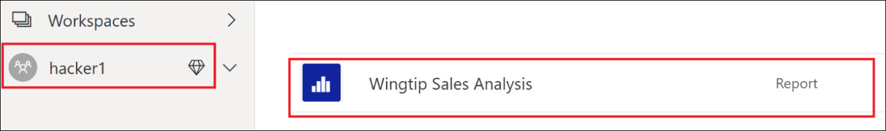

    Capture the Workspace ID, Report ID, and Dataset ID for this report and put it into notepad.

1. Launch Visual Studio Code – which can be found on your virtual machine.

   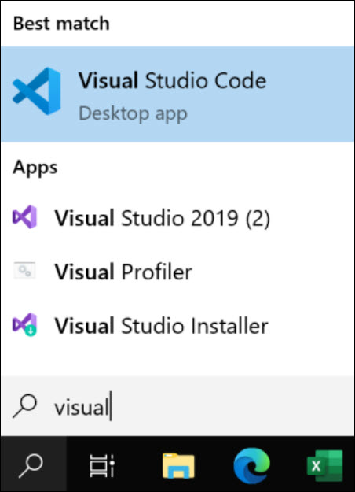

1. In Visual Studio Code – click on **Open Folder** and point to the folder where the solution can be 
found – this folder should be on your desktop:

   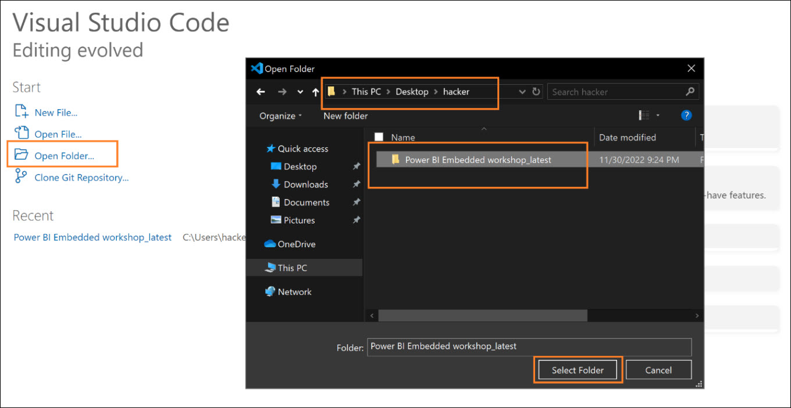

1. Navigate to the `/appsettings.json` file and **add/update** the Azure AD and Power BI configurations 
i.e., client ID, tenant ID, client secret, workspace ID, report ID, and dataset ID.

    **Important**:

    1. Azure AD configurations (client ID, tenant ID, client secret) will be shared with you 
during the session.
    
    1. For Power BI configuration, you can refer to the earlier steps where you captured
workspace ID, report ID, dataset ID.

   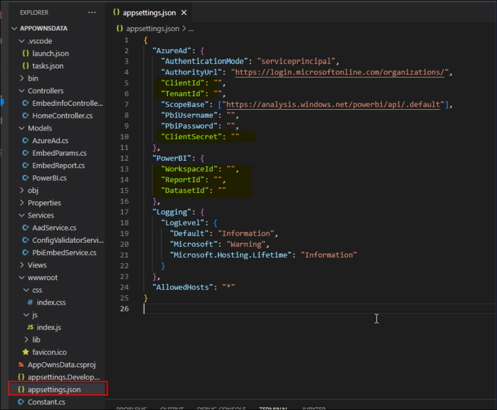

1. Click on the Terminal and type in `dotnet run` and Enter to run the sample code to embed the 
power bi report `Wingtip Sales Analysis` in READ mode.

   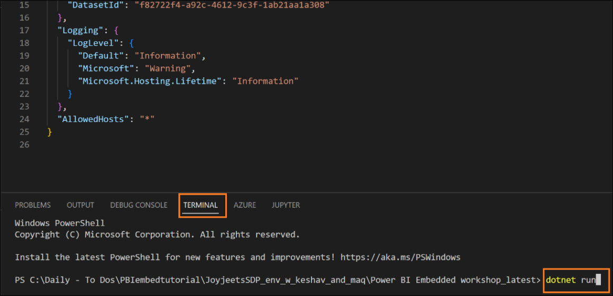

1. Once the code is executed, you can click on the link `https://localhost:5001` as shown below to 
launch the browser/app:   

   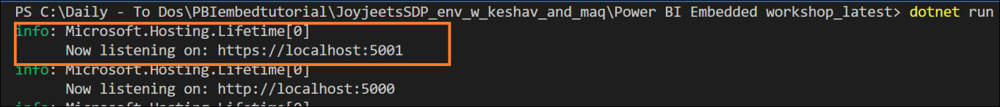

1. Once the browser is launched, you should see a web app that has now embedded your “Wingtip 
Sales Analysis” report you viewed from Power BI in the earlier steps.

   

   Navigate the report like you did when you were in the power bi service and note the interactivity. Now, 
leave the browser open and go back to your Visual Studio Code.

1. Open `/wwwroot/js/index.js` file. **Uncomment** the WRITE MODE embedding (i.e., line #59).

   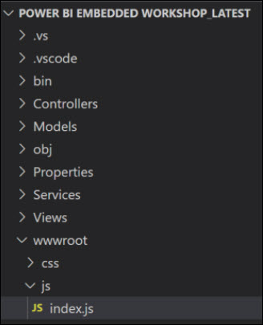

   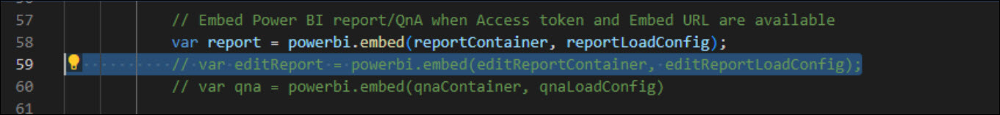   

1.  Save the code CTRL-S in Visual Studio Code; and refresh the web page in browser. You should 
see the same Wingtip Sales Analysis Report as a second report below the original report –
except – now you have edit/modification capabilities:

   

1. Perform a test update to the embedded report and verify that the updates are getting reflected 
in Power BI service report after clicking on the SAVE button. 

   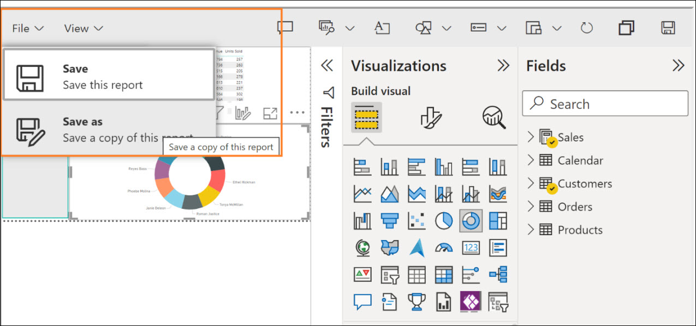

   In this module, you have learnt to embed a report in Read and Edit mode.

### Module 2: Embedding Q&A

1. In `/wwwroot/js/index.js` file, add/update the dataset ID on line #11.

   

   Important:

   1. Dataset ID was captured earlier in the exercise

1.Uncomment the Q&A embed code (i.e., line #60) to embed a Q&A visual

   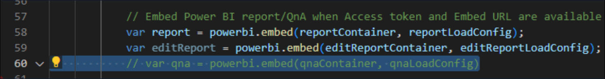   

1. Save the code CTRL-S in Visual Studio Code; and refresh the web page in browser4. Try querying the 
dataset through the question suggestions in the visual to view the output  

   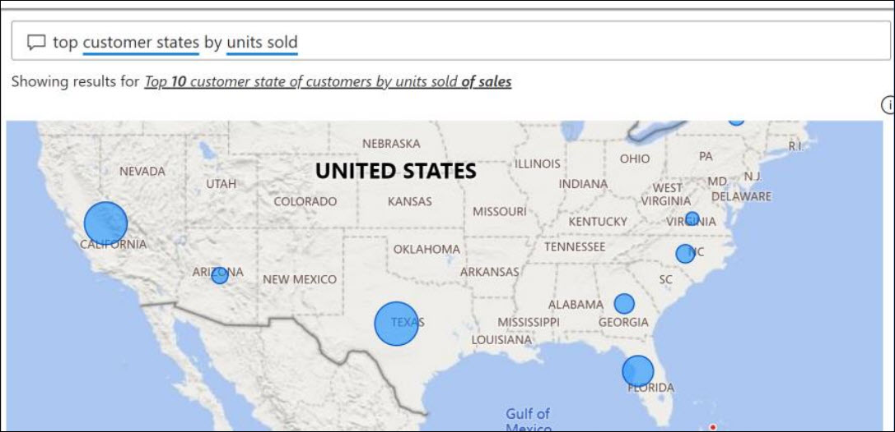

   You can also type **top 5 customer segments by customer unit** as a custom question and check the results.

   In this module, you have learnt to embed Q&A into your web application   

### Module 3: Export to CSV

1. Comment line #12 to enable the **Export to CSV** button by adding **//** in front of the export statement.

   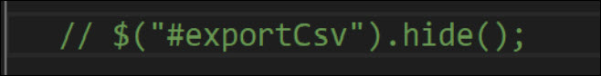

1. Save the code; and refresh the web page in browser.

1. Click on “Export to CSV” button on the top right of the embedded report. A CSV file named will get downloaded with the exported data present in it.

1. You can also hover over the visuals and click on the … to export the data – as shown below:

   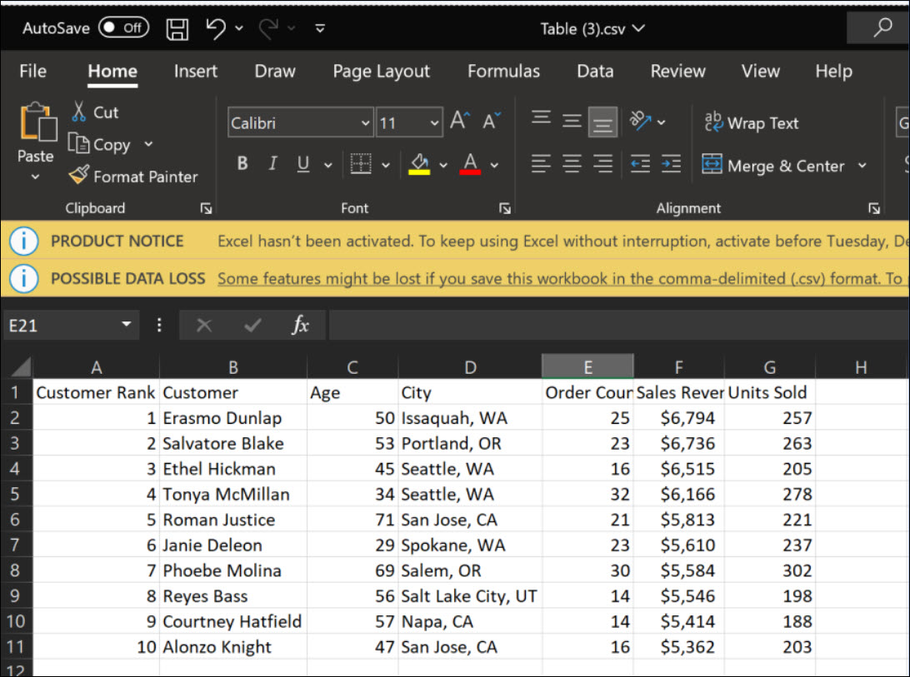

1.  You can also hover over the visuals and click on the … to export the data – as shown below:

   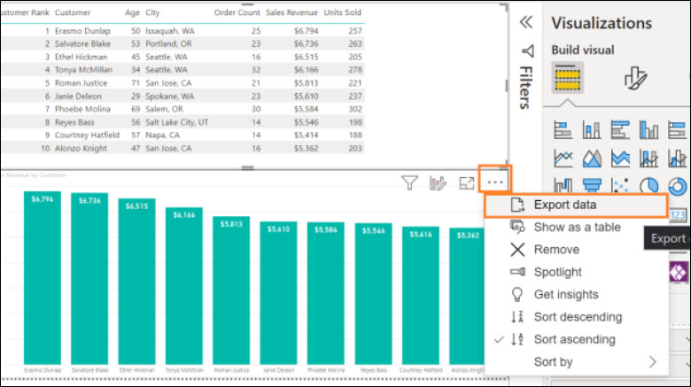   

1.  Please note – you will be prompted to explore various options as part of your export – make sure to choose the CSV option as shown below:   

   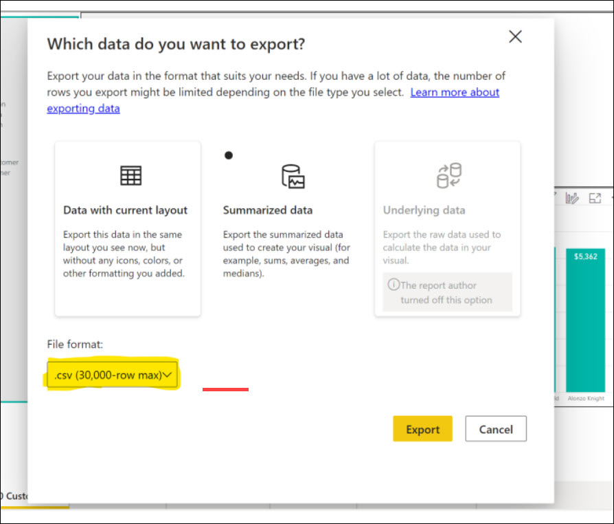

### Module 4: Embedding with RLS

1. Download the **Sales and Returns Sample without RLS** from your Power BI HackerXX workspace.

   

1. Open your **Sales and Returns Sample without RLS** report in the Power BI desktop.   

1. In this part, we will create a role in order to enable row level security. In our case, we are going to apply row level security (RLS) on Internal v/s External stores so that,internal users can only see internal sales data and external users can only see external sales data.Here is a sample of the Store data:

   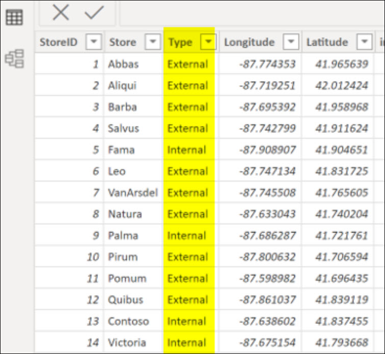

   1. Open PBI report and click on Modeling tab.

   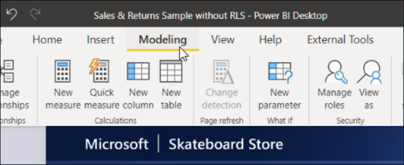

   1. Click on Manage roles option and then click on Create button.

   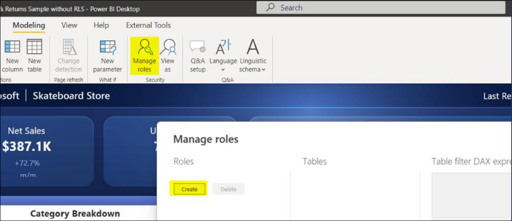

   1. Create a role named “john” and then click on Store table in the section.
   
   1. Set the filter for this user as [Store] = “External”.

   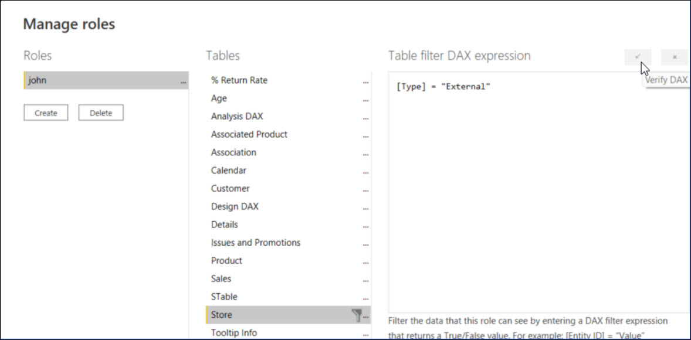   

   1.  Save and publish the report to PBI service.

1.  In `/Services/PBIEmbedService.cs` file, **uncomment** line #118

   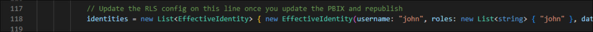  

1. Update the username and role values to the new role which you have created in PBI Desktop.

1. Similar to Module 1 earlier, navigate to /appsettings.json file and update your parameters to reflect the new report “Sales and Returns Sample without RLS”.

1. Click on the Terminal and type in **dotnet run** and Enter to run the sample code.

   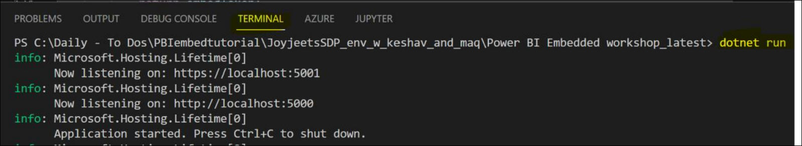 

1. . Now, you can see that the numbers in the visual are slightly on the lower side due to user (john) 
specific filtering.

1. In this module, you have learned to embed a Power BI report with data security as per user’s context.
  