# Power BI Embedded Workshop Guide

### Estimated Duration: 4 Hours

## Overview

In this lab, you'll embed **Power BI reports** into a web application using **Power BI** Embedded. You’ll publish a pre-built report to the **Power BI** Service and integrate it into a custom app using the **App Owns Data** model. The lab also covers key features like **Q&A natural language queries, data export**, and **row-level security (RLS)** to deliver personalized and interactive reporting experiences.

## Lab Objectives

You will be able to complete the following tasks:

- Module 1: Embed a Power BI report using App Owns Data embedding
- Module 2: Embed Q&A (Question & Answer) for a Power BI dataset
- Module 3: Understand exporting a visual’s data 
- Module 4: Enable data security based on user context

## Module 1: Embed a Power BI report using App Owns Data embedding

In this module, you will embed a Power BI report into your application using the App Owns Data embedding method.

1. From the left navigation pane, click **Workspaces (1)**, select the **ellipsis (...) (2)** next to your **hacker<inject key="DeploymentID" enableCopy="false" />** workspace, and click **Workspace access (3)**.

     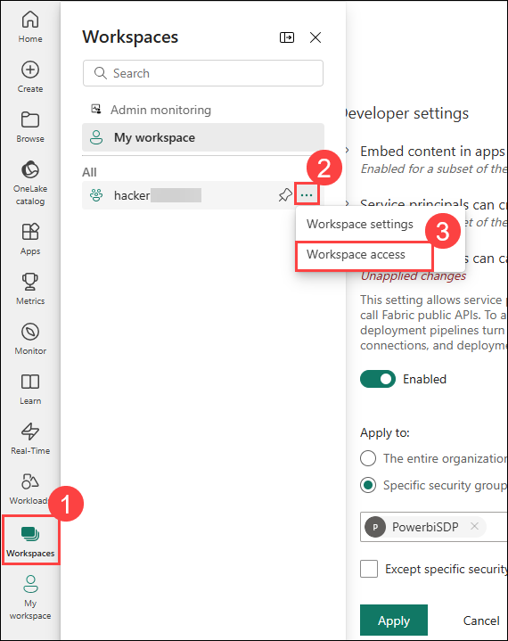

1. In the Manage access panel, click **+ Add people or groups**.
   
     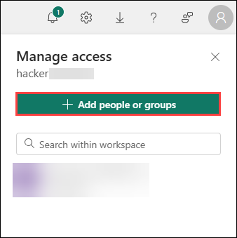

    >**Note:** If the window does not appear, try opening the portal in an InPrivate browser window. 
   
1. In the Add people window, type and select **PowerbiSDP (1)** in the search box, use the **dropdown (2)** to select **Admin (3)** role, click **Add (4)**, then click the **X (5)** button to exit the panel.

     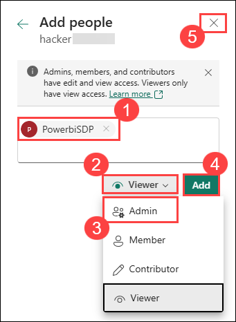 

1. From the left navigation pane, open the **hacker<inject key="DeploymentID" enableCopy="false" />** **(1)** workspace and select the **Wingtip Sales Analysis (2)** report.

     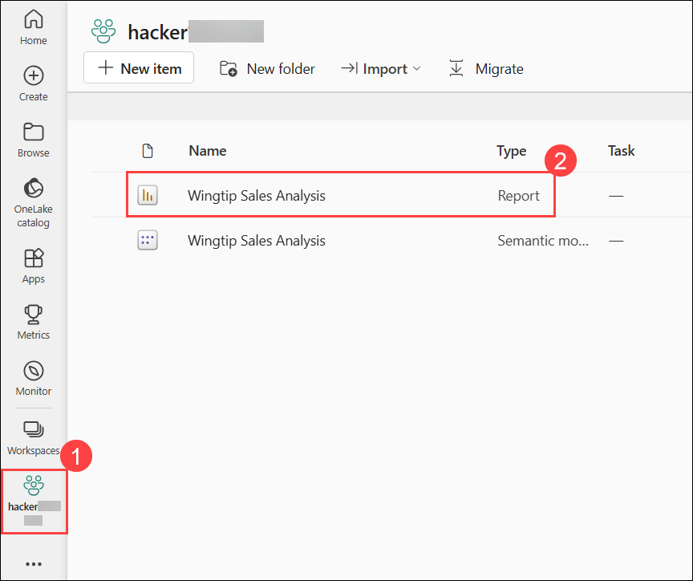  

1. From the browser’s address bar, copy the **Workspace ID (1)** and **Report ID (2)**, then save them in a notepad for use in later steps.

     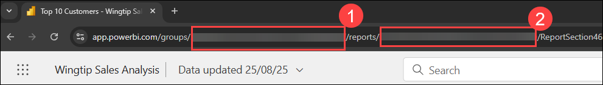 

1. Go back to the **hacker<inject key="DeploymentID" enableCopy="false" />** **(1)** workspace from the left navigation pane and select the **Wingtip Sales Analysis (2)** semantic model.

     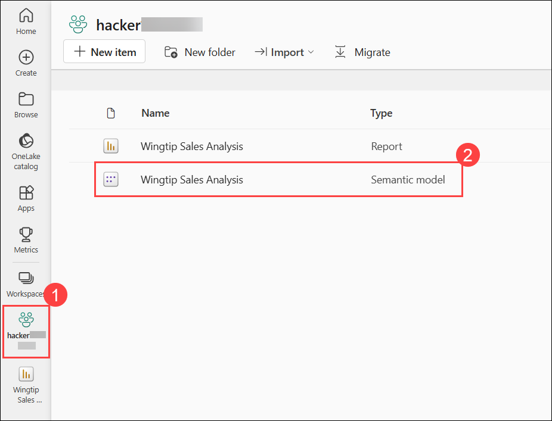  
    
1. From the browser’s address bar, copy the **Dataset ID** and save it in a notepad for use in later steps

     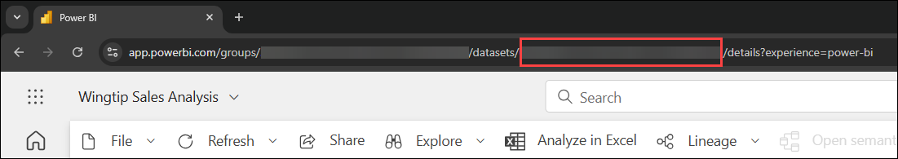    

1. From the taskbar, click the **Visual Studio Code** icon to launch the application.

     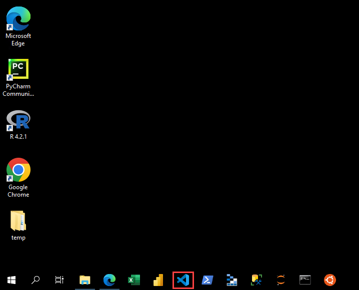 

   >**Note** : The application might take a few seconds to load.

1. In VS Code, if the **Power BI Embedded workshop_latest** folder is not already opened, click on **Open Folder (1)**, navigate to `C:\Users\hacker1\Desktop\hacker` **(2)**, select the **Power BI Embedded workshop_latest (3)** folder, and click **Select Folder (4)**.

     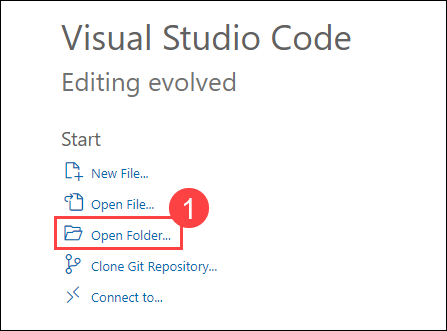 

     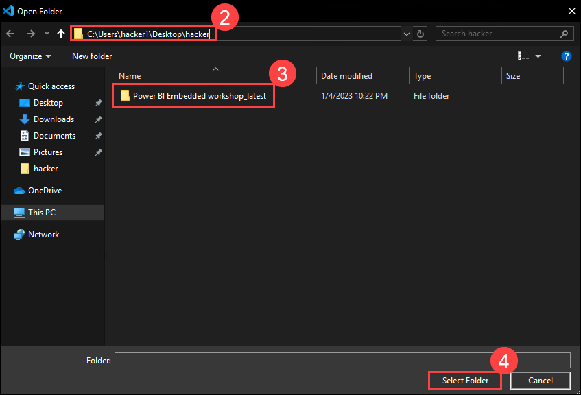 

      >**Note:** If prompted with the **Do you trust the authors of the files in this folder?** pop-up, click **Yes, I trust the authors**.

       
  
1. Once the folder is open, click on the **appsettings.json (1)**, replace **ClientId (Application ID) (2), TenantId (3), ClientSecret (Secret key) (4)** in the lines **5**,**6**, and **10** respectively. You can find these Id's under the **Service Principal Details (6)** option in the **Environment Details (5)** tab. After replacing the required Id's save the file using **CTRL+S**. Compare the **WorkspaceId**, **ReportId**, **DatasetId (7)** in lines 13, 14, and 15 with the Id's you copied in previous steps. 

   >**Note:** The Id's are automatically replaced with the workspace ID, Report ID, and Dataset ID of hacker<inject key="DeploymentID" enableCopy="false" /> workspace respectively.

     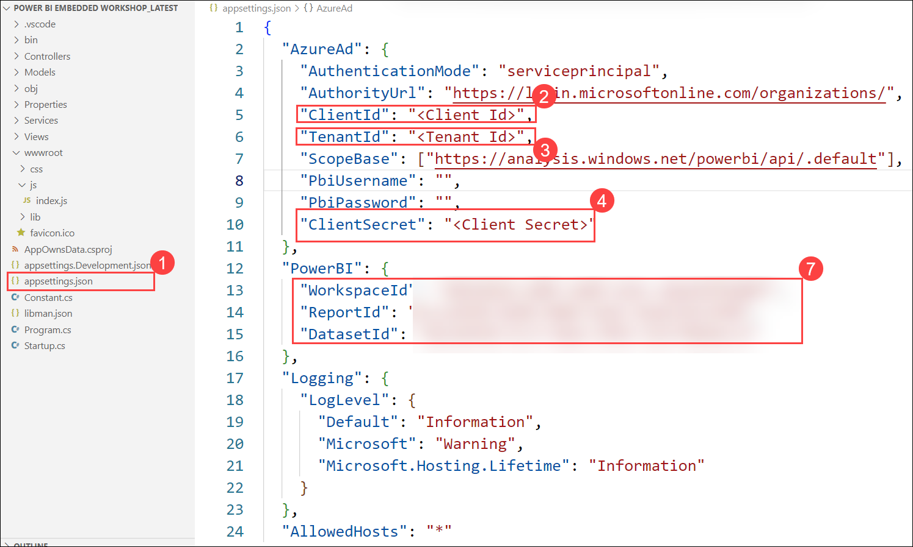

     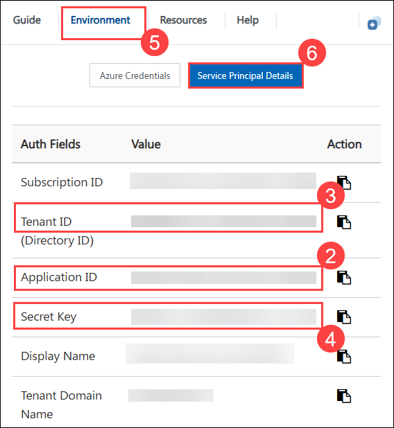
   
1. Click the **ellipsis (⋯) (1)** from the top menu, go to **Terminal (2)**, and select **New Terminal (3)**.

     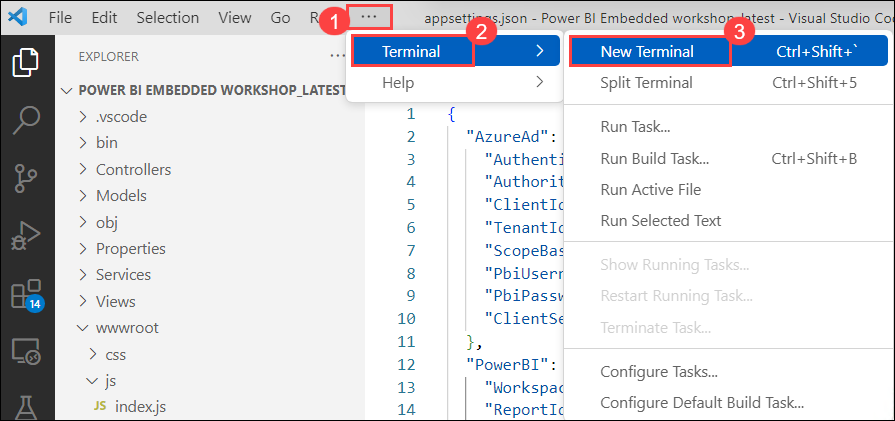

1. Run the command below and press **Enter** to execute the sample code that embeds the **Wingtip Sales Analysis** Power BI report in READ mode, then observe the output.

    ```
   dotnet run
    ```
   
   >**Note** : If you encounter any errors, run `dotnet dev-certs https` in the terminal, then re-run the application using `dotnet run`.

1. Once the code is executed, hold the **Ctrl** key and click the link `https://localhost:5001`
 in the terminal to launch the browser and open the app.

     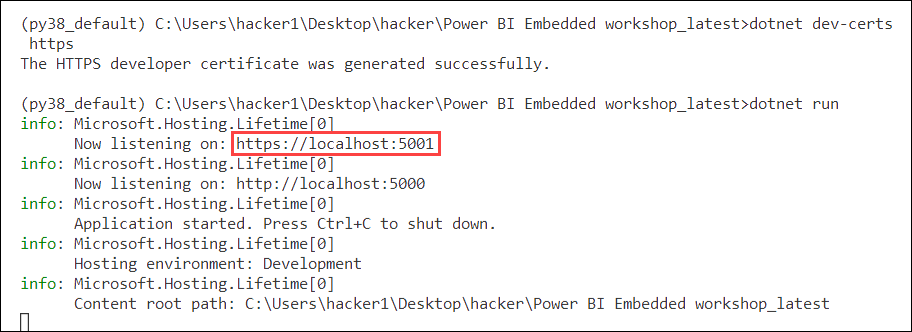

1. In the web browser, if you see a **Your connection isn’t private** warning, click **Advanced (1)**, then choose **Continue to localhost (unsafe) (2)**.

     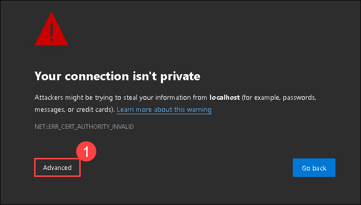

     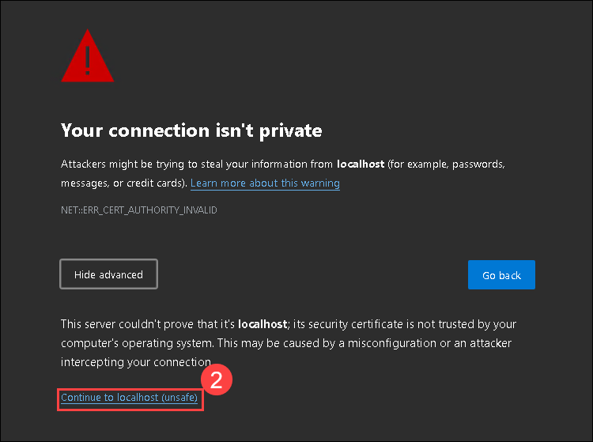

1. Once the browser launches, you should see the web app displaying your **Wingtip Sales Analysis** report embedded from Power BI.

     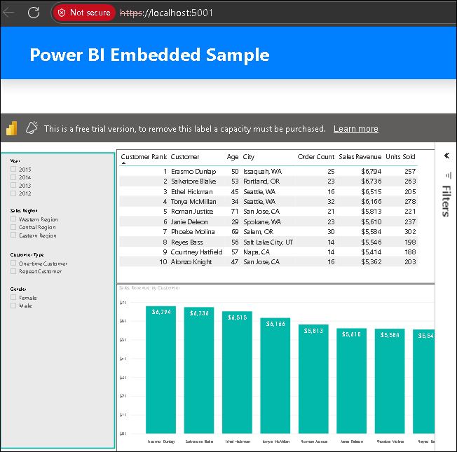

1. Explore the report and observe its interactive features. Once done, keep the browser window open for the upcoming steps.

1. In Visual Studio Code, open the **`/wwwroot/js/index.js` file (1)**, then **uncomment** the line on **line 59 (2)** to enable **Edit Mode**, then press **Ctrl + S** to save the file.

     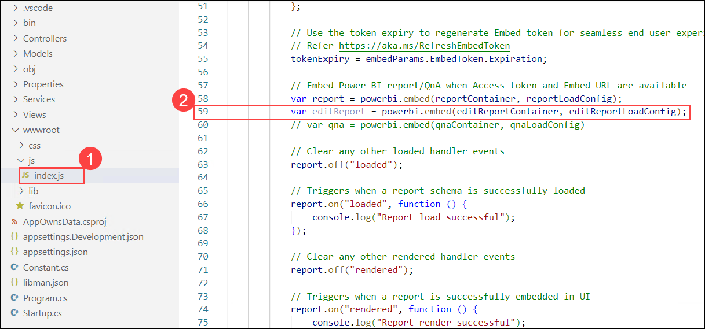

1. After refreshing, you’ll see the **Wingtip Sales Analysis** report embedded twice. One in read-only mode and the second with full edit capabilities.

    >**Note:** If you are not able to find and edit the report, please access the same URL in a different web browser or in InPrivate window.
   
     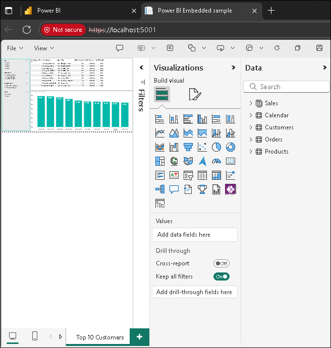

1. From the report canvas on the left-hand pane, select the existing **chart (1)**, then from the Visualizations pane on the right, change the chart type to a **Donut chart** by clicking the corresponding **icon (2)**.

     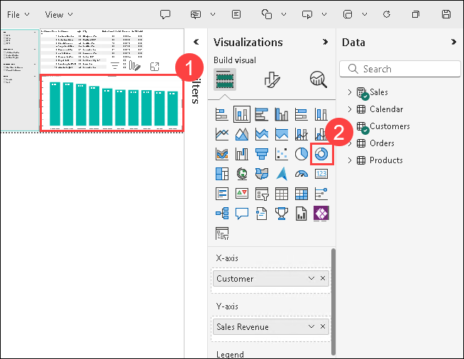

    >**Note:** You can also click on the ellipsis (...) on the chart, choose **New visual calculation**, and select the Donut chart to update the embedded report.

    

1. From the top-left corner, click **File (1**), select **Save as (2)**, enter **Wingtip Sales Analysis updated Report (3)** in the prompt, and then click **Save (4)** to save your changes.

     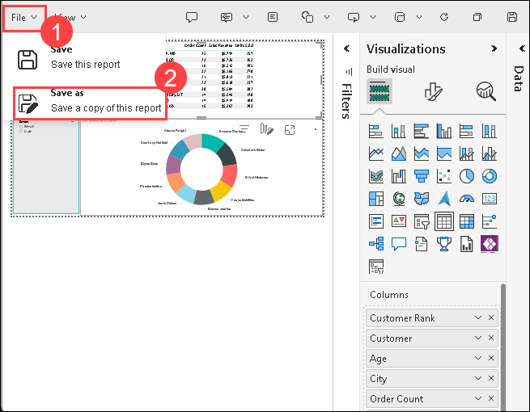

     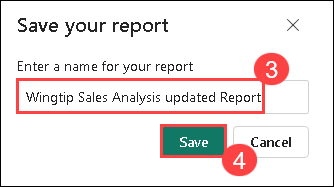

1. Go to the browser tab where your **hacker<inject key="DeploymentID" enableCopy="false" />** workspace is open, then refresh the page to load and visualize the updated report.

     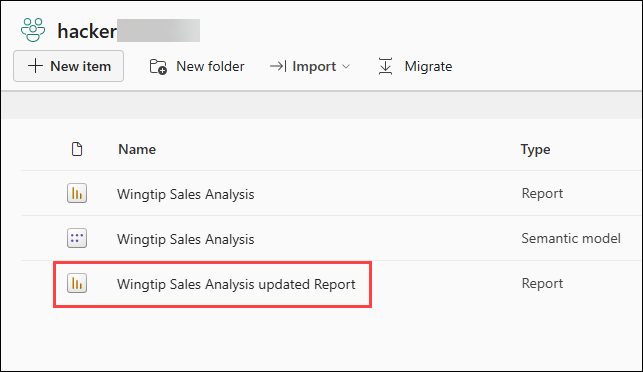

## Module 2: Embed Q&A (Question & Answer) for a Power BI dataset

In this module, you will integrate the Q&A feature in Power BI to allow users to query the dataset using natural language.

1. In VS Code, open the file `/wwwroot/js/index.js` **(1)** and confirm that the **Dataset ID (2)** on **line #11** is already updated.

     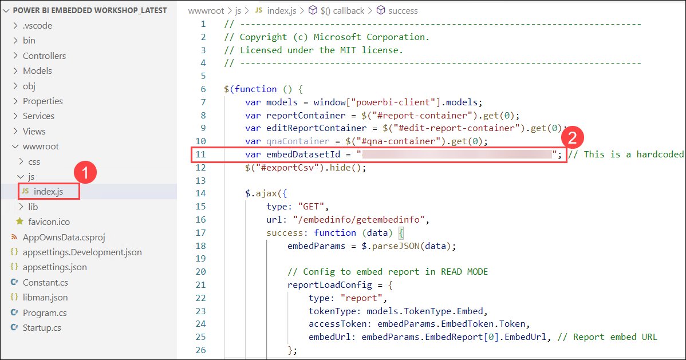

1. In the same index.js file, **uncomment** the Q&A embed code at **line #60** to enable embedding the Q&A visual, then save your changes using **CTRL+S**.

     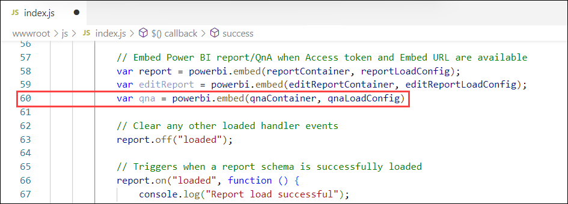

1. Navigate back to the browser and refresh the web page. Scroll down to the bottom, select the **Ask a question about your data (1)** box, enter the query **top customer states by units sold (2)** in the input box, and observe the visualized results.

     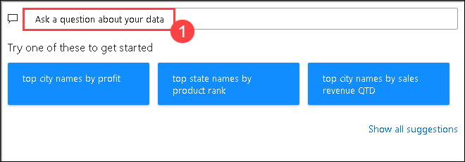

     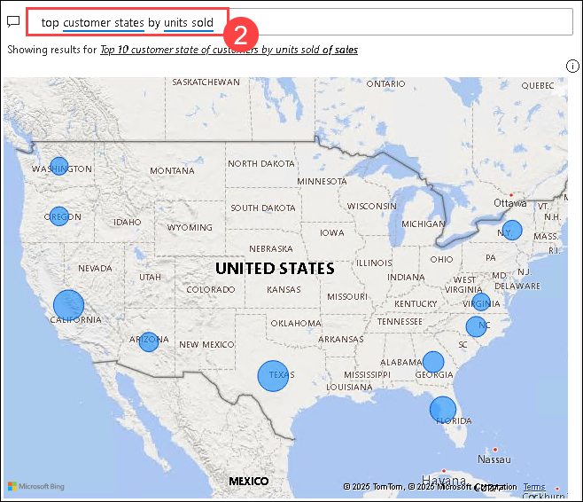

    >**Note:** You can also type **top 5 customer segments by customer unit** as a custom question and check the results.
 
## Module 3: Understand exporting a visual’s data

In this module, you will learn how to export the underlying data from a Power BI visual for further analysis.

1. Navigate back to VS Code, open the `/wwwroot/js/index.js` **(1)** file, comment **line #12 (2)** by adding `//` before the export statement to enable the **Export to CSV** button, and press **CTRL+S** to save the changes.

     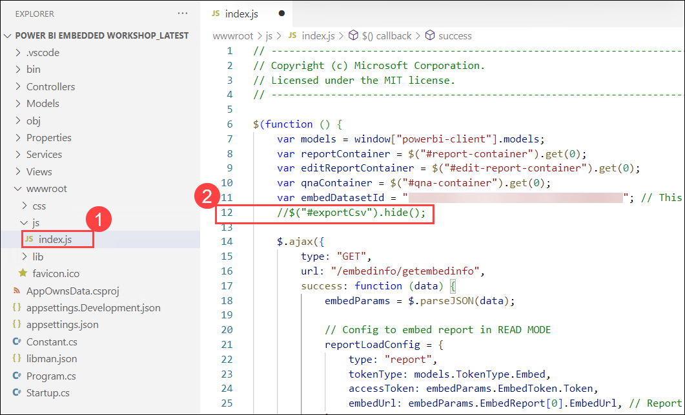

1. Navigate back to the browser and refresh the web page. Then, from the top right of the embedded report, click the **Export to CSV** button. A **CSV** file containing the exported data will automatically be downloaded.

     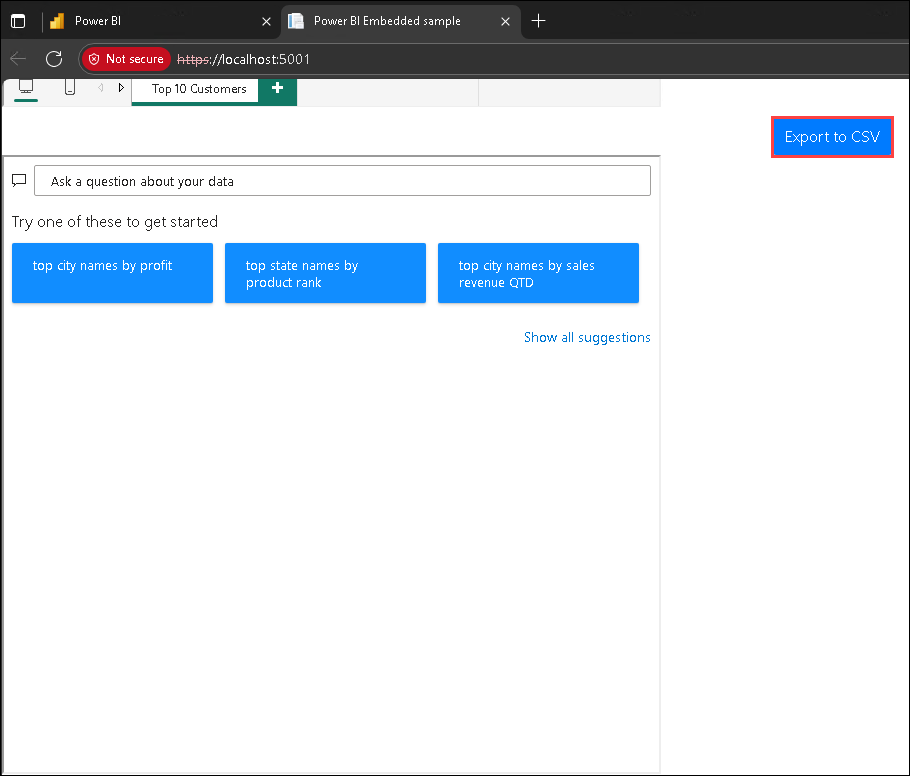

1. Alternatively, you can export visual-specific data by clicking the **ellipsis (...) (1)** icon from the top-right corner of the visual and selecting **Export data (2)** from the menu.

     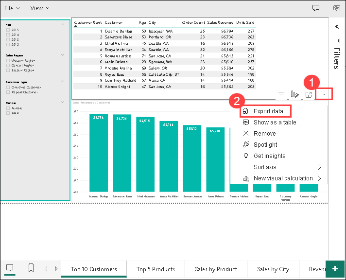  

1. In the **Which data do you want to export?** popup, choose **Summarized data (1)**, select **.csv (30,000-row max) (2)** as the file format from the dropdown, and click **Export (3)** to download the data.

     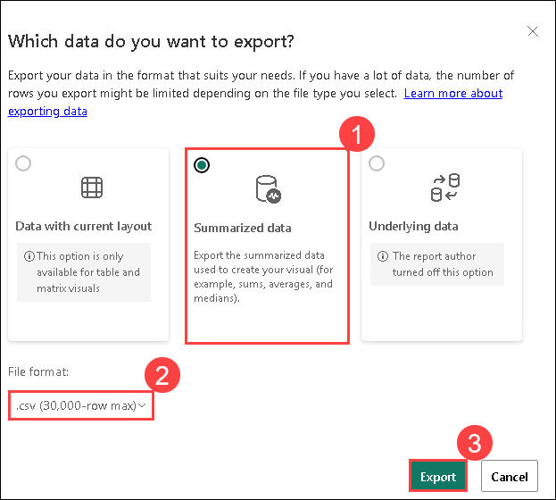  

## Module 4: Enable data security based on user context

In this module, you will create a role to enable row level security. In this case, you are going to apply row level security (RLS) on Internal v/s External stores so that, internal users can only see internal sales data and external users can only see external sales data.

1. From the Desktop, open **File Explorer (1)**, navigate to the **`C:\LabFiles` (2)** directory, and double-click to open the **Sales & Returns Sample without RLS.pbix file (3)**.

     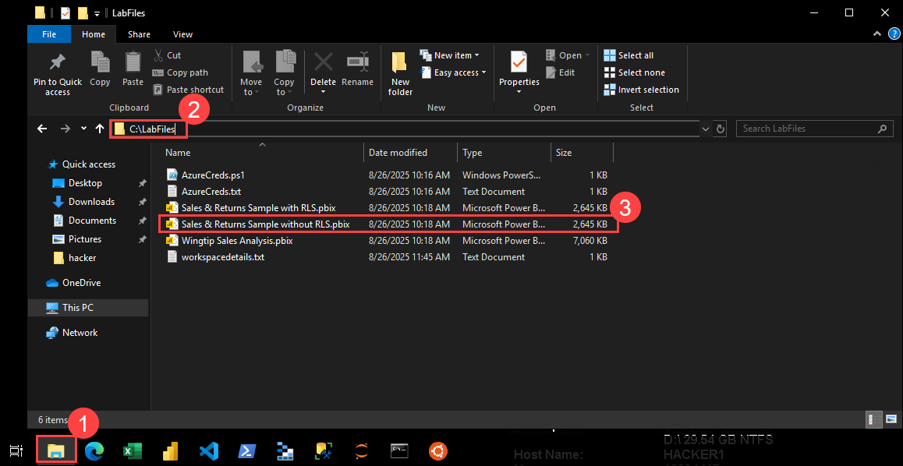 

1. If the Enter your email address pop-up appears, enter the following email address and click **Continue (2)**.

   - **Email:** <inject key="AzureAdUserEmail"></inject> **(1)**

     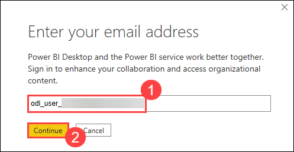    

1. Click on the **<inject key="AzureAdUserEmail"></inject>** account to sign in and continue.
     
     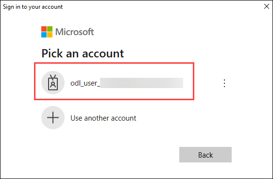   

1. Now enter the following password and click on **Sign in (2)**.
   
   - **Password:** <inject key="AzureAdUserPassword"></inject> **(1)** 
   
     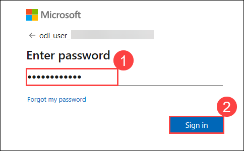   

1. In the Power BI application, navigate to the **Modeling (1)** tab at the top, click on **Manage roles (2)** under the Security section, and then click the **Create (3)** button in the Manage roles window.

     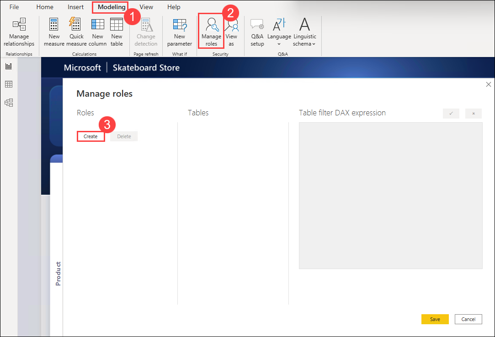  

1. Create the role by following these steps:

   - Create a role named **john (1)**.
   - Select **Store (2)** table.
   - Enter `[Type] = "External"` **(3)** in Table filter DAX expression and click on **verify (4)**. 
   - Finally, click on **Save (5)** button.

     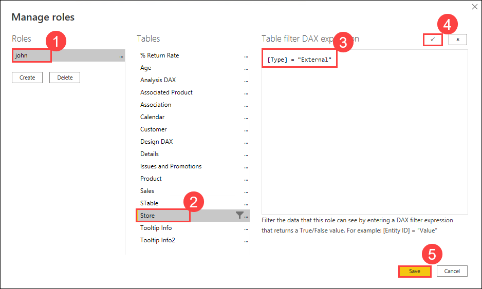  

1. From the top-left corner of the Power BI Desktop window, click on the **File** menu to access the application options.

     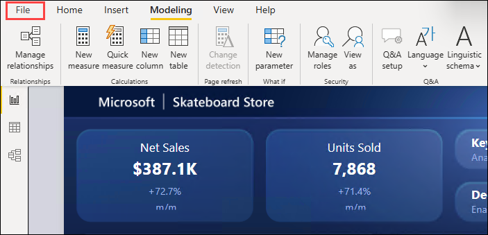

1. Click on the **Save** from the left-hand menu to save the report.

     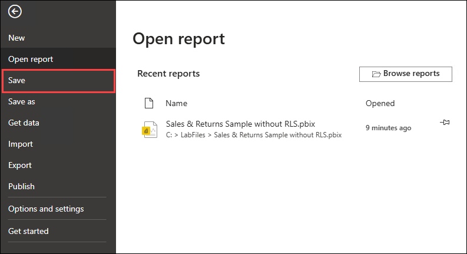

1. From the top-left corner of the Power BI Desktop, click **File (1)**, then select **Publish (2)** from the left-hand menu, and click on **Publish to Power BI (3)**.

     

     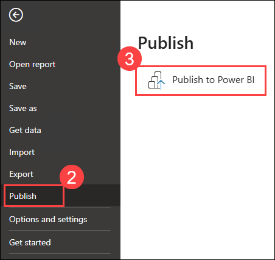

1. From the Publish to Power BI dialog, select the workspace named **hacker<inject key="DeploymentID" enableCopy="false" /> (1)**, then click the **Select (2)** to publish your report.

     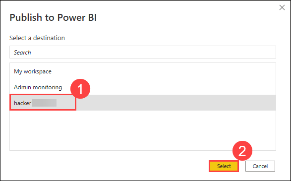
   
   > **Note:** If it ask for Replace this dataset? click on **Replace**

    

   > **Note:** Please wait until the report gets published.

1. Click **Got it** to close the publishing confirmation dialog.

     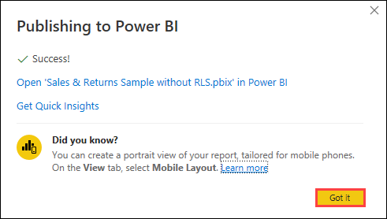

1. From the Power BI portal, navigate to the **hacker<inject key="DeploymentID" enableCopy="false" /> (1)** workspace using the left-hand pane, then locate and open the **Sales & Returns Sample without RLS (2)** report.

     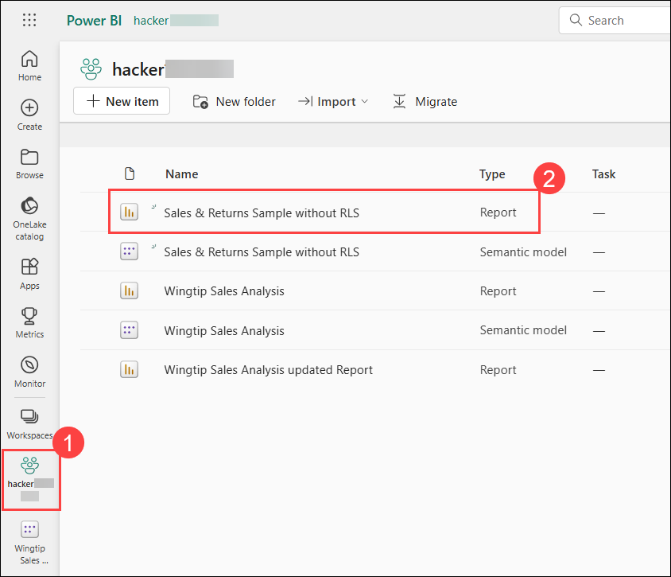 

1. From the browser’s address bar, copy the **Workspace ID (1)** and the **Report ID (2)**, then paste and save both values in a Notepad file for use in later steps.

     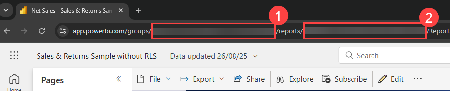 

1. From the Power BI portal, navigate to the **hacker<inject key="DeploymentID" enableCopy="false" /> (1)** workspace using the left-hand pane, then locate and open the **Sales & Returns Sample without RLS (2)** semantic model.

      
    
1. From the browser’s address bar, copy the **Dataset ID** and save it in a Notepad file for use in upcoming steps.

     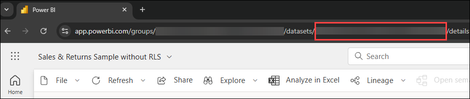   

1. In Visual Studio Code, from the left-hand file explorer, navigate to `/Services/PbiEmbedService.cs` **(1)**, scroll to **line #118 (2)**, **uncomment** the line initializing the identities list, and press **Ctrl+S** to save the file.

     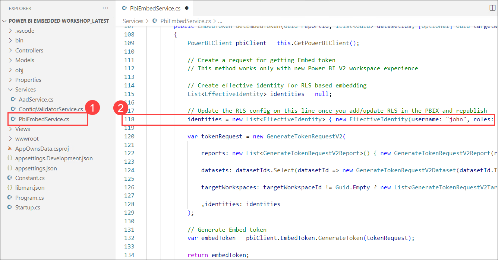   

1. Review that the Username and role values to the new role that you have created in Power BI Desktop are already updated.

     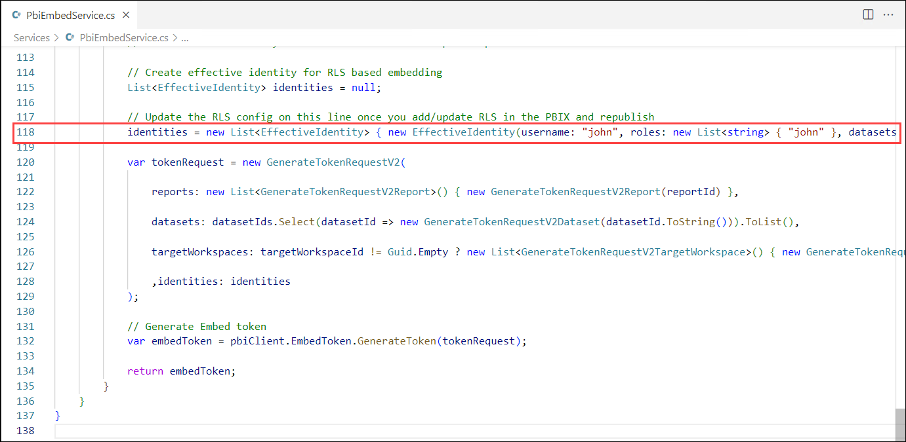
    
1. Navigate to the `/appsettings.json` **(1)** file from the left-hand pane in Visual Studio Code, and update the values for **WorkspaceId**, **ReportId**, and **DatasetId (3)** under the **PowerBI** section using the IDs you copied in the previous steps for the report **Sales and Returns Sample without RLS**. Press **CTRL+S** to save the changes.

     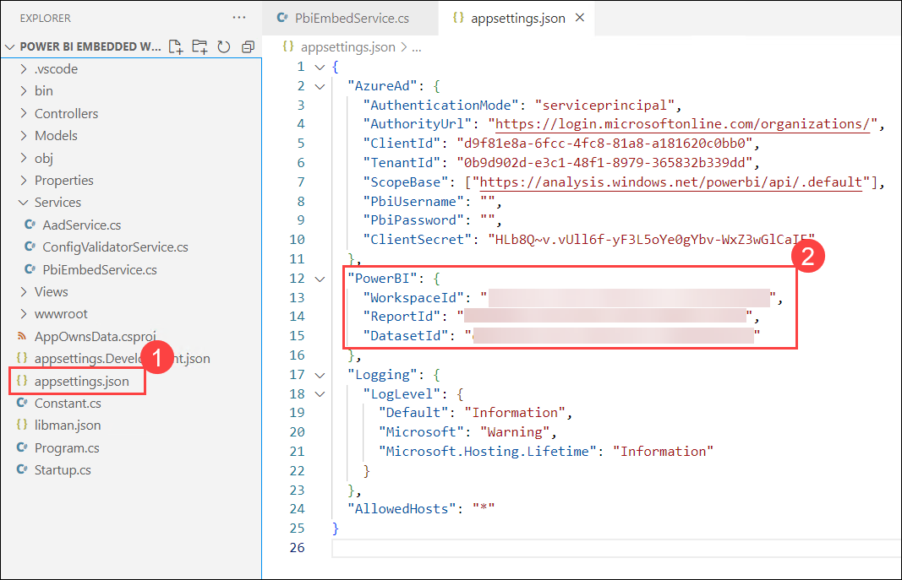

1. From the top menu bar, click the **terminal** icon or press **Ctrl + ` (backtick)** to open the terminal.

     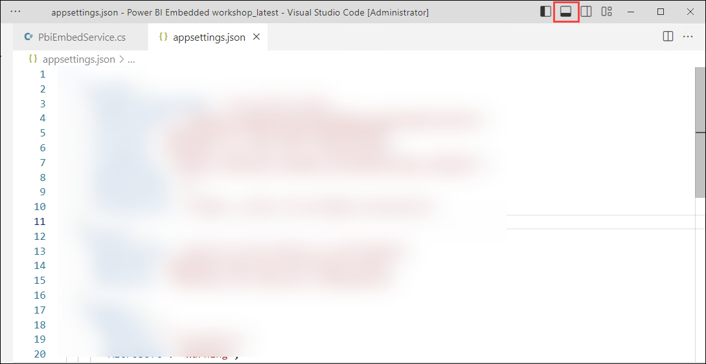

1. Run the below command and press **Enter** to run the sample code.

    ```
   dotnet run
    ```

   >**Note** : If the sample code from Module 1 is still running, use **Ctrl + C** to stop it, and then execute the `dotnet run` command.

1. Once the code is successfully executed in the terminal, hold the `Ctrl` key and click on the link `https://localhost:5001` to launch the embedded Power BI app in your default web browser.

      

1. Now, you can see that the numbers in the visual are slightly on the lower side due to the user (john) 
specific filtering. You can compare the **Power BI Embedded Sample** report with the **Sales & Returns Sample without RLS** report which you updated in previous steps in the PowerBI desktop application.

     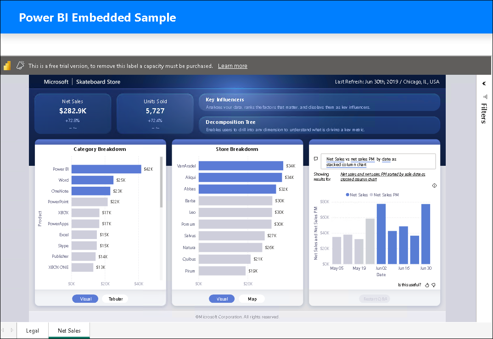 
   
     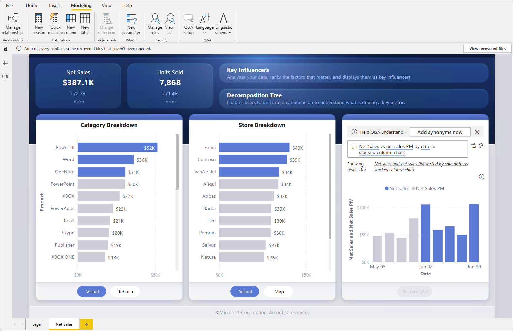 

## Summary 

In this lab, you have completed the following:

- Embedded a Power BI report using App Owns Data embedding
- Integrated the Q&A feature in Power BI for natural language queries
- Exported data from a Power BI visual for further analysis
- Configured row-level security to ensure data security based on user context

## You have successfully completed the Hands-on lab.

By completing this hands-on lab on **Power BI Embedded**, you have gained practical experience in integrating Power BI capabilities into custom applications. You embedded a Power BI report using the App Owns Data embedding method, enabling seamless access to interactive reports. You also integrated the Q&A feature, allowing users to interact with data using natural language queries. Additionally, you learned how to export data from Power BI visuals for further analysis and configured row-level security (RLS) to ensure users only see data relevant to their role. This lab has equipped you with the foundational skills to build secure, interactive, and user-friendly embedded analytics solutions using Power BI.

  


