# Power BI Embedded

### Estimated Duration: 4 Hours

## Overview

**Power BI Embedded** enables the integration of interactive data visualizations into applications. It allows embedding of **Power BI** reports, managing authentication through **Azure AD**, and using the **Power BI REST API** to deliver embedded business intelligence features.

## Lab Objectives

You will be able to complete the following tasks:

- **Module 1**: Embed a Power BI report using App Owns Data embedding
- **Module 2**: Embed Q&A (Question & Answer) for a Power BI dataset
- **Module 3**: Understand exporting a visual’s data 
- **Module 4**: Enable data security based on user context

## Module 1: Embedding Your First Power BI report

In this module, you will embed a Power BI report into your application using the App Owns Data embedding method.

1. From the side blade, click on **Workspaces (1)** and select **ellipse button** **(2)** adjacent to hacker<inject key="DeploymentID" enableCopy="false" />, and click on **Workspace access (3)**.

   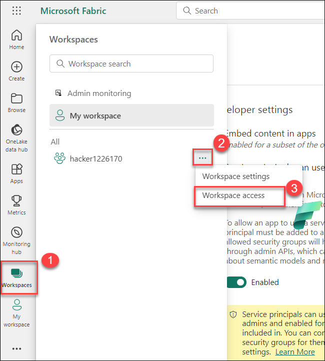

1. In the Manage access tab, select **+ Add people or groups**.
   
   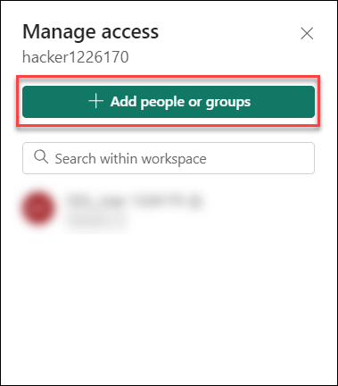

    >**Note**: If you are unable to see the window, please open it via InPrivate Window. 
   
1. In the next window that opens, in the **Enter name or email** search box type and select **PowerbiSDP (1)** security group, click on the **dropdown (2)** to open dropdown and select **Admin (3)** privilege from the drop down, and click on **Add (4)** button. Once added, click on **close (5)** button to close the tab.

   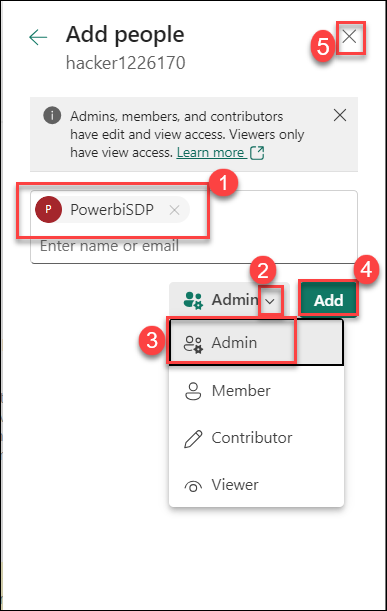  

1. From the browser tab, open **hacker<inject key="DeploymentID" enableCopy="false" />** **(1)** workspace and select **Wingtip Sales Analysis (2)** report.

   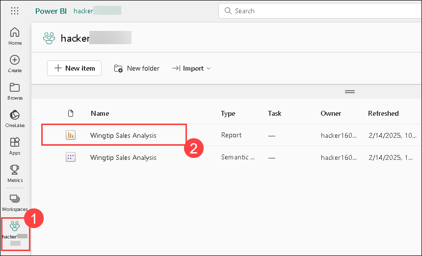   

1. Copy the **Workspace ID (1)** and **Report ID (2)** from the URL. Save it in a notepad and you'll be using the value in further steps.

    

1. Go back to **hacker<inject key="DeploymentID" enableCopy="false" />** **(1)** workspace and select **Wingtip Sales Analysis (2)** semantic model.

   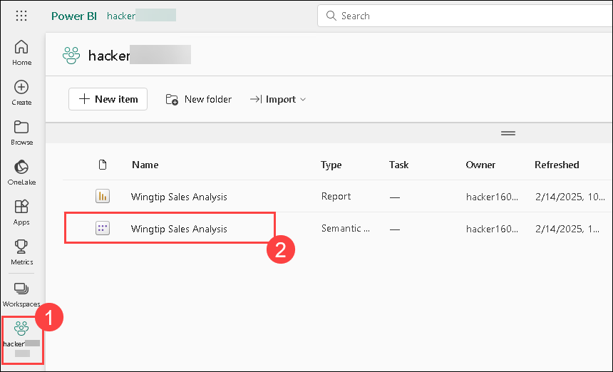   
    
1. Copy the **Datsaset ID (1)** and save it in a notepad. You'll be using the value in further steps.

   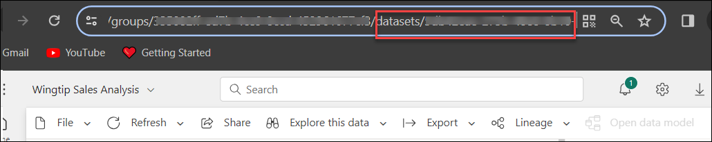   

1. From the taskbar, select the **Visual Studio Code** icon to open the application.

    

   >**Note** : The application might take a few seconds to load.

1. In the VS Code, click on **Open Folder** and navigate to `C:\Users\hacker1\Desktop\hacker` path and make sure to select and open the folder **Power BI Embedded workshop_latest**. 

      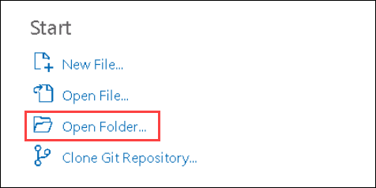

      >**Note**: If prompted with the **Do you trust the authors of the files in this folder?** pop-up, click **Yes, I trust the authors**.

      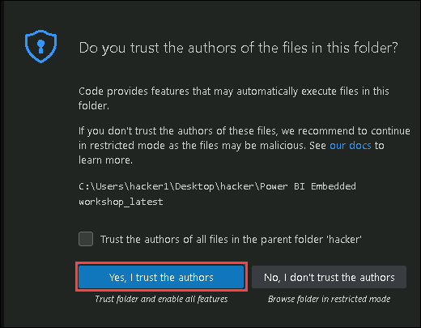 
  
1. Once the folder is open, click on the **appsettings.json (2)** to open it, replace **ClientId (Application ID), TenantId, ClientSecret (Secret key) (3)** in the lines 5,6, and 10 respectively. You can find these Id's under the **Service Principal Details** option in the **Environment Details (4)** tab. After replacing the required Id's save the file using **CTRL+S**. Compare the **WorkspaceId**, **ReportId**, and **DatasetId** in lines 13, 14, and 15 with the Id's you copied in previous steps. 

   >**Note:** The Id's are automatically replaced with the workspace ID, Report ID, and Dataset ID of hacker<inject key="DeploymentID" enableCopy="false" /> workspace respectively.

   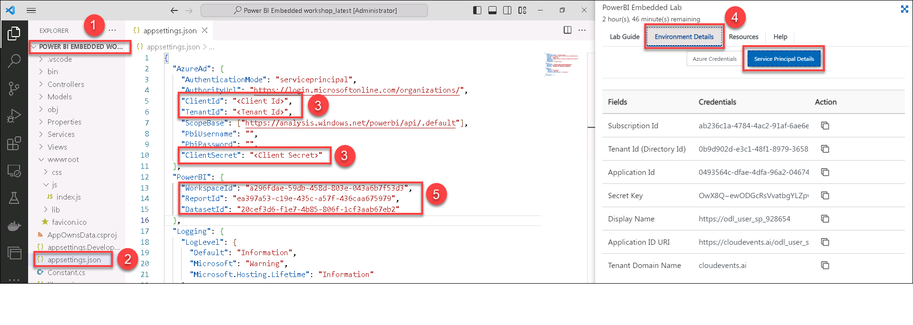
   
1. Click on the **Ellipsis (...) (1)** from the top, click on **Terminal (2)** and select **New Terminal (3)**.

   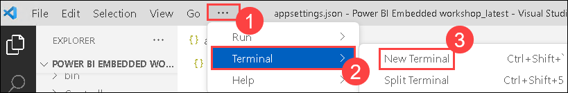

1. Run the below command and press **Enter** to run the sample code to embed the power bi report `Wingtip Sales Analysis` in READ mode and observe the output.

    ```
   dotnet run
    ```
   
   >**Note** : If you're encountering any errors, try running this command first: `dotnet dev-certs https`, and then execute the `dotnet run` command again.

1. Once the code is executed, hold the `Ctrl` key and click on the link `https://localhost:5001` to launch the browser/app:   

   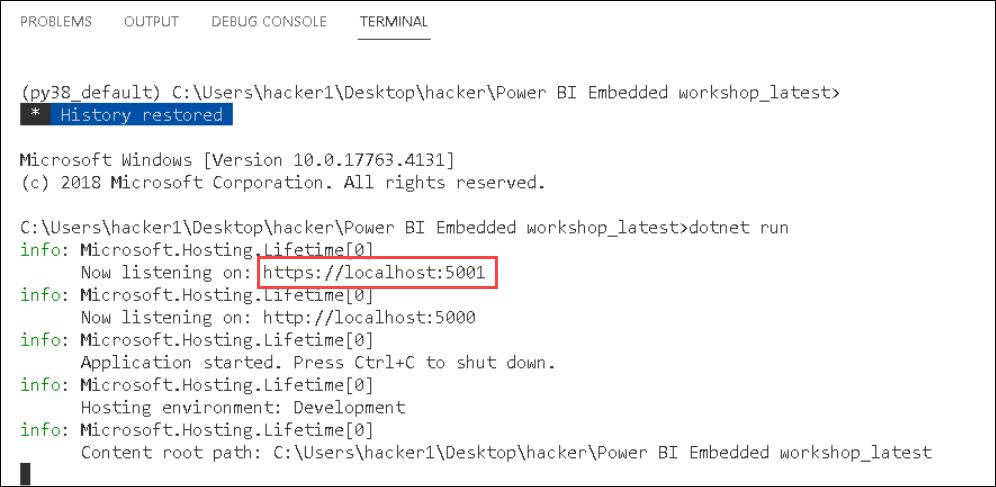

1. In the web browser, If you see the Your connection isn't private pop-up, click on **Advanced**, then select **Continue to localhost (unsafe)**.

      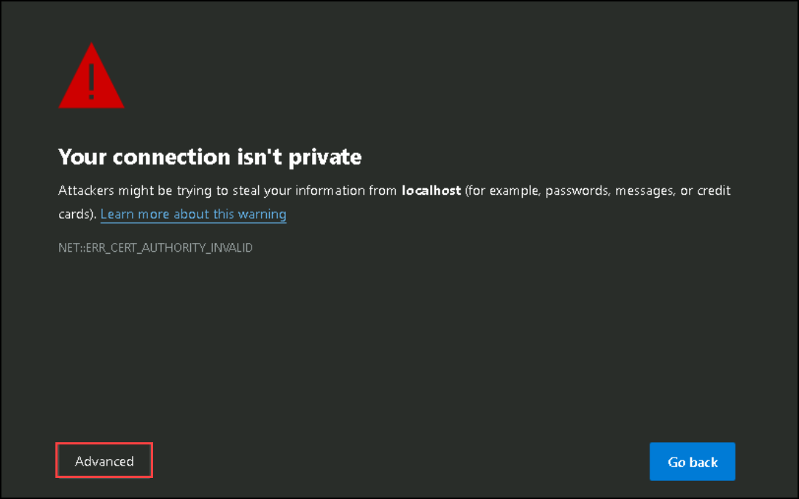

      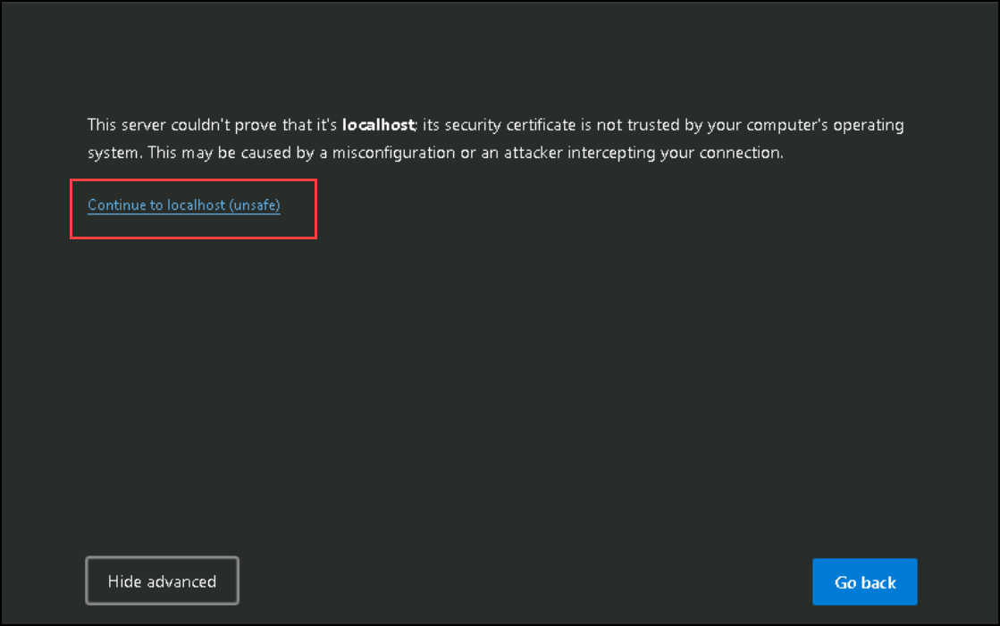

1. Once the browser is launched, you should see a web app that has now embedded your **Wingtip Sales Analysis** report you viewed from Power BI in the earlier steps.

    

1. Navigate and explore the report and note the interactivity. Now, leave the browser open.

1. Navigate to VS Code, open `/wwwroot/js/index.js` **(1)** file. **Uncomment (2)** the WRITE MODE embedding in line #59 and save the file.

    

1. Refresh the web page in the browser and scroll down. You should see the same Wingtip Sales Analysis Report as a second report below the original report –
except – now you have edit/modification capabilities:
   
   >**Note:** If you are not able to find and edit the report, please access the same URL in a different web browser or in InPrivate mode.
   
   

1. Perform a test update to the embedded report like, select the **chart (1)**, change the chart into **Donut chart (2)**.

   

   >**Note** : You can also click on the ellipsis (...) on the chart, choose New visual calculation, and select the Donut chart to update the embedded report.

   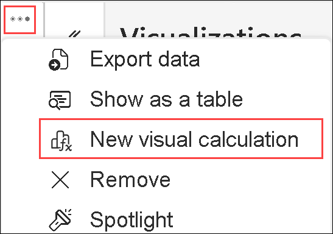

1. Click on **File (1)**, click on **Save as (2)** button, and provide the name as **Wingtip Sales Analysis updated Report (3)**, and click on **Save (4)**.   

   

1. Navigate to browser tab where you have the **hacker<inject key="DeploymentID" enableCopy="false" />** workspace open. Then refresh the tab and now you'll be able to visualize the new report.

   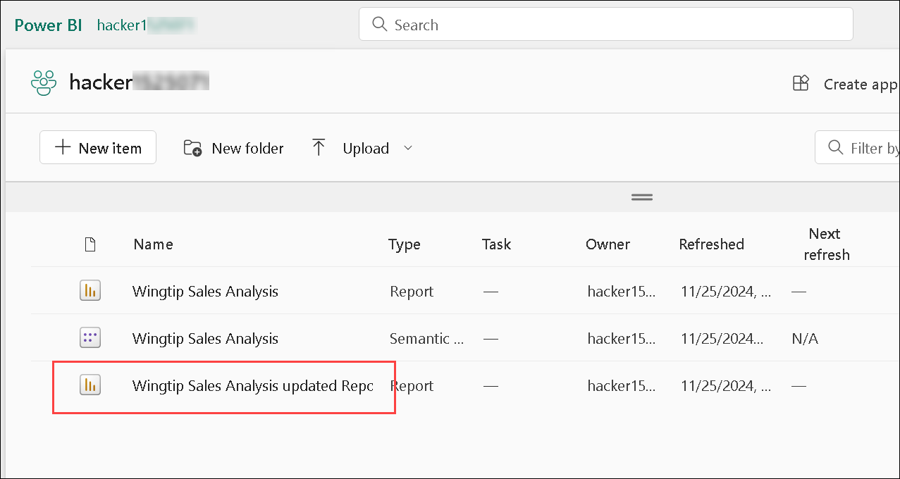

   In this module, you have learned to embed a report in Read and Edit mode.

### Module 2: Embedding Q&A

In this module, you will integrate the Q&A feature in Power BI to allow users to query the dataset using natural language.

1. Navigate back to VS Code, in `/wwwroot/js/index.js` file, verify if the **Dataset ID** is already updated in **line #11**.

   

1. In the same Index.js file, **uncomment** the Q&A embed code in **line #60** to embed a Q&A visual and save the code using **CTRL+S**.

      

1. Navigate back to the browser and refresh the web page and scroll down to the bottom. click on **Ask a question about your data(1)** button, paste **top customer states by units sold (2)** in the query box, and you'll be able visualize the results.

   

   - You can also type **top 5 customer segments by customer unit** as a custom question and check the results.

   In this module, you have learned to embed Q&A into your web application.   

### Module 3: Export to CSV

In this module, you will learn how to export the underlying data from a Power BI visual for further analysis.

1. Navigate back to VS Code and open `/wwwroot/js/index.js` file. Comment **line #12** to enable the **Export to CSV** button by adding **//** in front of the export statement and save the code using **CTRL+S**.

   

1. Navigate back to browser and refresh the web page. Click on **Export to CSV** button on the top right of the embedded report. A CSV file will get downloaded with the exported data present in it.

   

1. You can also export the data by clicking on the **ellipse (1)** button and select **Export data (2)**

      

1. In Which data do you want to export pop up, select **Summarized data (1)**, select **.csv (30,000-row max) (2)** as File format, and click on **Export (3)**. 

   

### Module 4: Embedding with RLS

In this module, we will create a role to enable row level security. In our case, we are going to apply row level security (RLS) on Internal v/s External stores so that, internal users can only see internal sales data and external users can only see external sales data.

1. From Desktop, open **File explorer (1)**, navigate to `C:\LabFiles` **(2)** directory, and open **Sales and Returns Sample without RLS.pbix (3)** file.

   

1. If Enter your email address pop-up appears, Provide the **Email: <inject key="AzureAdUserEmail"></inject>** **(1)**  and click on **Continue**.

      

1. Now enter the following password and click on **Sign in**.
   
   * **Password**: <inject key="AzureAdUserPassword"></inject>
   
      

1. In the Power BI application, select **Modelling (1)** tab, click on **Manage roles (2)**, and click on **Create (3)** button.

   

1. Follow the below-mentioned steps to create the role.

   - Create a role named **john (1)**.
   - Select **Store (2)** table.
   - Enter `[Type] = "External"` **(3)** in Table filter DAX expression and click on **verify (4)**. 
   - Finally, click on **Save (4)** button.

   

1. Click on **File** present in top left corner.

   

1. Click on the **Save** button to save the report.

   

1. Click on **File** present in top left corner. Click on **publish (1)** button and select **Publish to Power BI (2)**.

   

1. Select the **hacker<inject key="DeploymentID" enableCopy="false" />** workspace and click on **Select (2)**.

   
   
   > **Note**: If it ask for Replace this dataset? click on **Replace**

     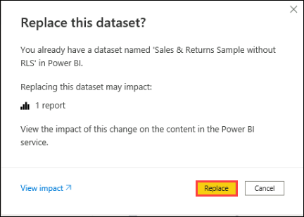 

   > **Note**: Please wait until the report gets published.

1. From the browser tab, open **hacker<inject key="DeploymentID" enableCopy="false" />** workspace and select **Sales & Returns Sample without RLS (2)** report.

   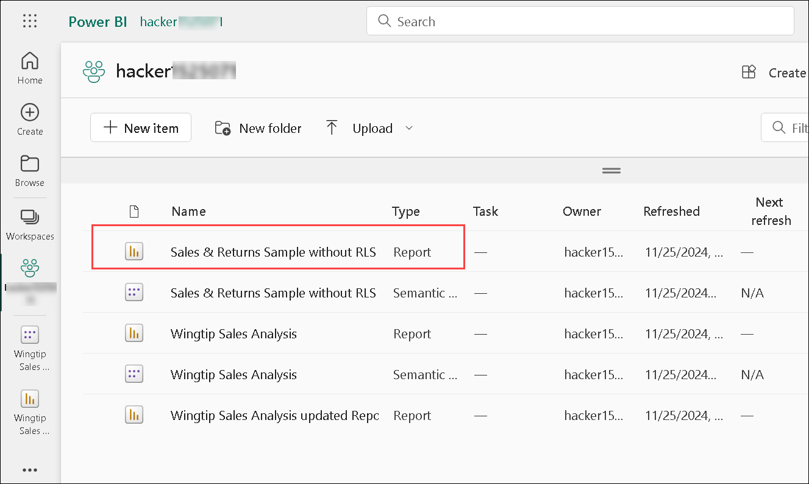   

1. Copy the **Workspace ID (1)** and **Report ID (2)** from the URL. Save it in a notepad and you'll be using the value in further steps.

    

1. From the browser tab, open **hacker<inject key="DeploymentID" enableCopy="false" />** workspace and select **Sales & Returns Sample without RLS (2)** semantic model.

   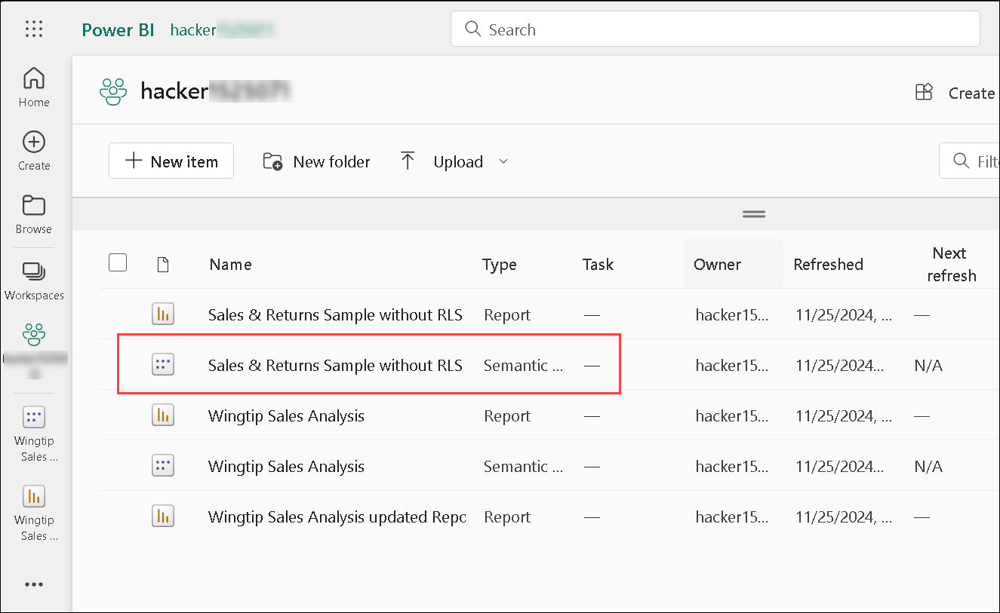   
    
1. Copy the **Datsaset ID (1)** and save it in a notepad. You'll be using the value in further steps.

   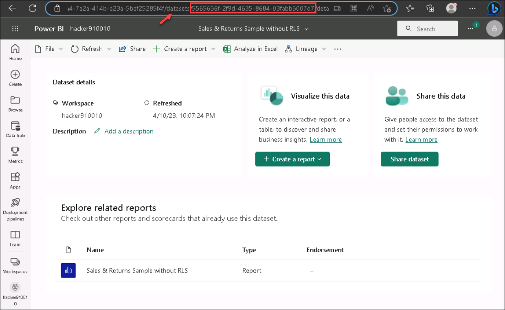    

1. Navigate back to VS Code, open `/Services/PBIEmbedService.cs` **(1)** file and **uncomment** line `#118` **(2)** and save the code using **CTRL+S**.

    

1. Review that the Username and role values to the new role that you have created in PBI Desktop are already updated.

    
    
1. Like in Module 1 earlier, navigate to /appsettings.json file and update the **workspace ID**, **Report ID**, and **Dataset ID** parameters copied in previous steps to reflect the new report “Sales and Returns Sample without RLS”. Save the code using **CTRL+S**.

    

1. Click on the **Ellipsis (...) (1)** from the top, click on **Terminal (2)** and select **New Terminal (3)**.

      

1. Run the below command and press **Enter** to run the sample code.

    ```
   dotnet run
    ```

   >**Note** : If the sample code from Module 1 is still running, use Ctrl + C to stop it, and then execute the `dotnet run` command.

1. Once the code is executed, hold the `Ctrl` key and click on the link `https://localhost:5001` to launch the browser/app:   

     

1. Now, you can see that the numbers in the visual are slightly on the lower side due to the user (john) 
specific filtering. You can compare the **Power BI Embedded Sample** report with the **Sales & Returns Sample without RLS** report which you updated in previous steps in the PowerBI desktop application.

   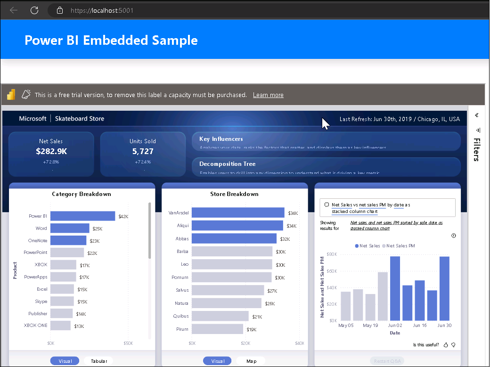
   
   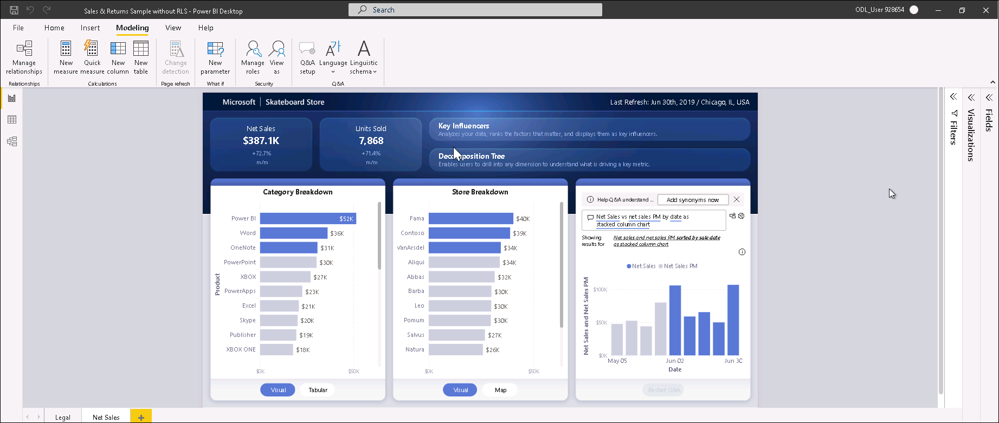

1. In this module, you have learned to embed a Power BI report with data security as per the user’s context.

## Summary 

In this lab you have covered the following:

- Embedded a Power BI report using App Owns Data embedding
- Integrated the Q&A feature in Power BI for natural language queries
- Exported data from a Power BI visual for further analysis
- Configured row-level security to ensure data security based on user context

## You have successfully completed the Hands-on lab.

By completing this hands-on lab on Power BI Embedded, you have gained practical experience in integrating Power BI capabilities into custom applications. You embedded a Power BI report using the App Owns Data embedding method, enabling seamless access to interactive reports. You also integrated the Q&A feature, allowing users to interact with data using natural language queries. Additionally, you learned how to export data from Power BI visuals for further analysis and configured row-level security (RLS) to ensure users only see data relevant to their role. This lab has equipped you with the foundational skills to build secure, interactive, and user-friendly embedded analytics solutions using Power BI.

  
