# Power BI Embedded Workshop Guide

## Outcome

At the end of this workshop, you will learn how to –
1. Module 1: Embed a Power BI report using App Owns Data embedding
1. Module 2: Embed Q&A (Question & Answer) for a Power BI dataset
1. Module 3: Understand exporting a visual’s data 
1. Module 4: Enable data security based on user context

## Module 1: Embedding Your First Power BI report

1. In browser, login into `https://app.powerbi.com/`. Provide the **Email: <inject key="AzureAdUserEmail"></inject>** **(1)**  and click on **Submit**.  
   
   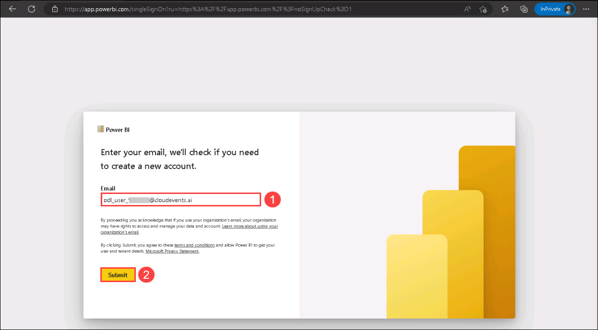
          
1. Now enter the following password and click on **Sign in**.
   
   * **Password**: <inject key="AzureAdUserPassword"></inject>
   
   

1. If you see the pop-up **Stay Signed in?**, select **No**.

1. From the side blade, click on **Workspaces (1)** and select **hacker<inject key="DeploymentID" enableCopy="false" />** **(2)** which is pre-created for the lab.

   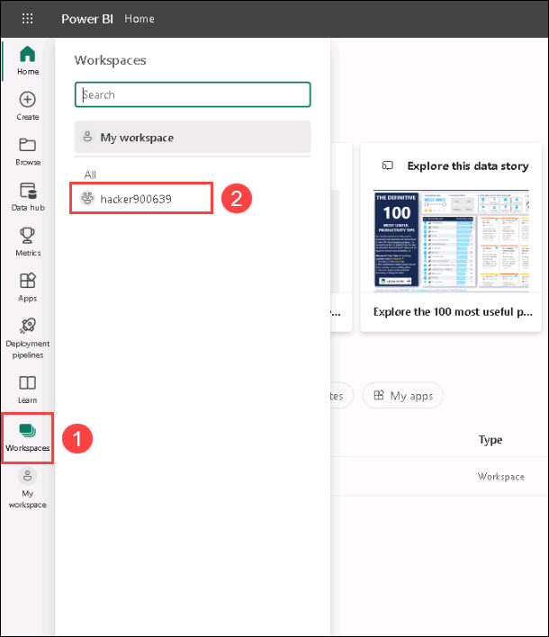

1. You'll be able to visualize the **Wingtip Sales Analysis** report uploaded in the workspace.

   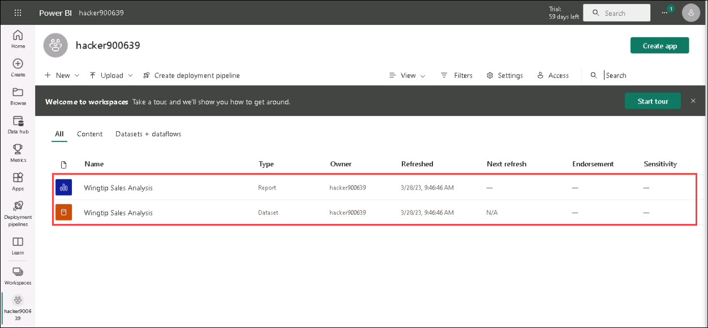

1. From the taskbar, select the **Visual Studio Code** icon to open the application.

   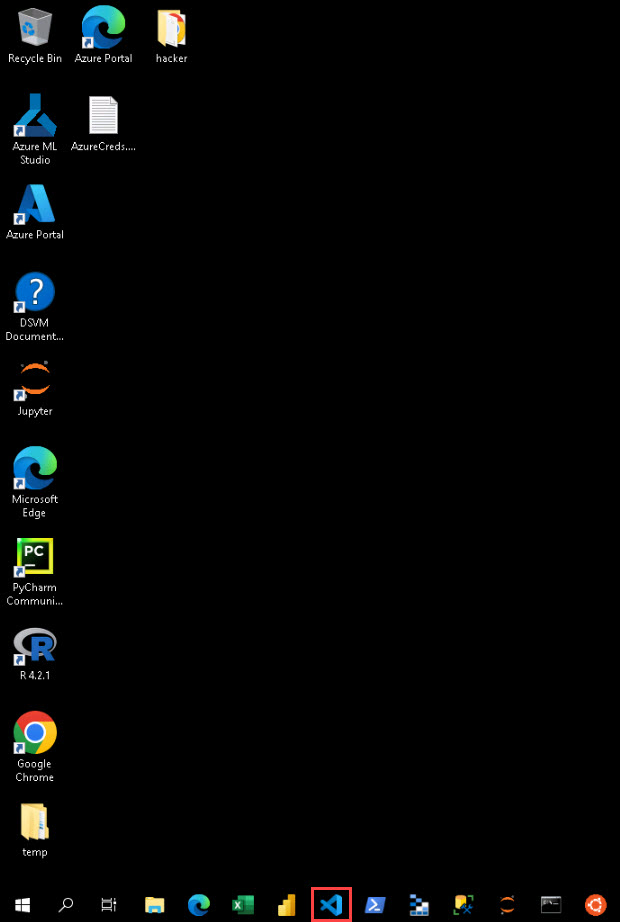 

1. From Power BI home page, Click on the **ellipse (1)** button, select the **Settings (2)**, and click on **Admin portal (3)** button.

   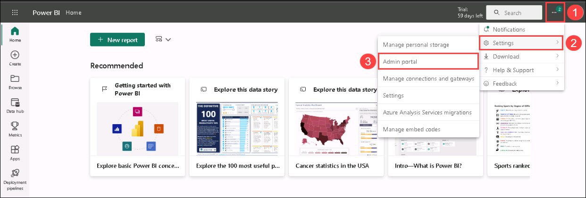

1. Scroll down to Developer settings, **Enable (1)** the Allow service principals to use Power BI APIs. Under Apply to option, select the **Specific security groups (Recommended) (2)** button, search and select **PowerbiSDP (3)** group. Finally, click on **Apply (4)**.    

   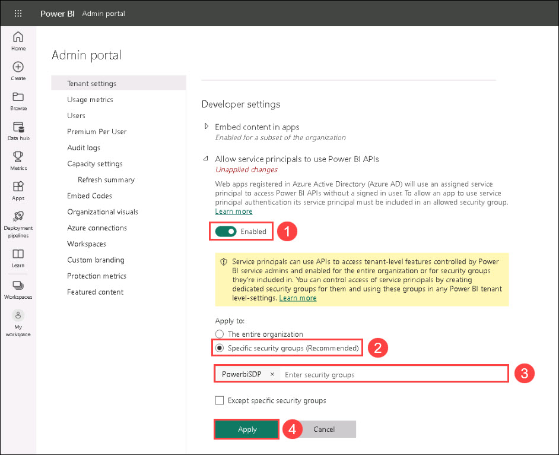

1. Scroll down to Admin API settings, **Enable (1)** the Allow service principals to use read-only Admin APIs. Under Apply to option, select the **Specific security groups (Recommended) (2)** button, search and select **PowerbiSDP (3)** group. Finally, click on **Apply (4)**.    

   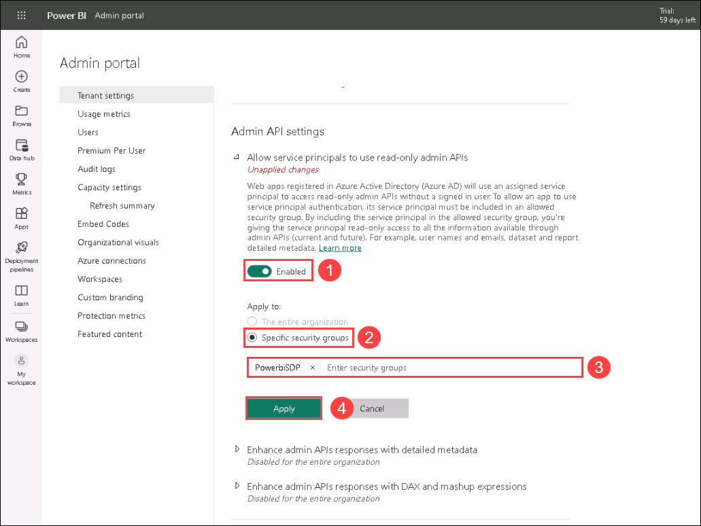   

1. From the side blade, click on **Workspaces (1)** and select **ellipse button** **(2)** adjacent to hacker<inject key="DeploymentID" enableCopy="false" />, and click on **Workspace access (3)**.

   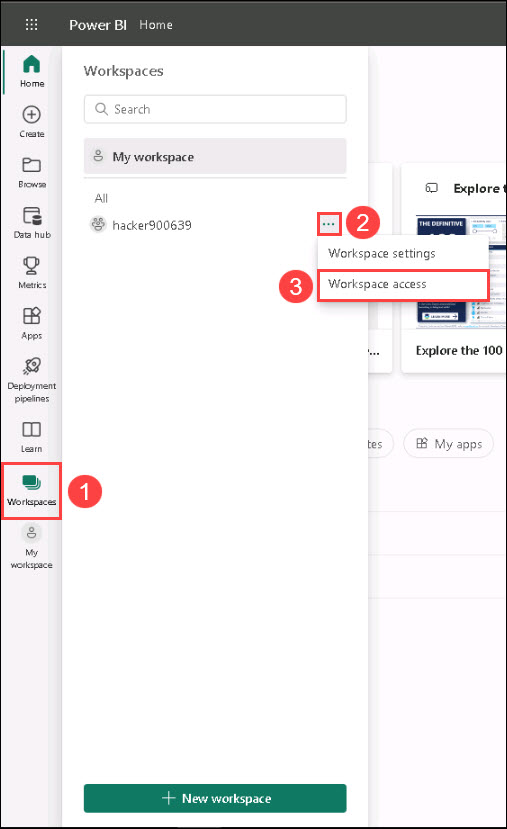

1. In the Access tab, search and select **PowerbiSDP (1)** security group, select **Admin (2)** privilege from the drop down, and click on **Add (3)** button. Once added, click on **close (4)** button to close the tab.

   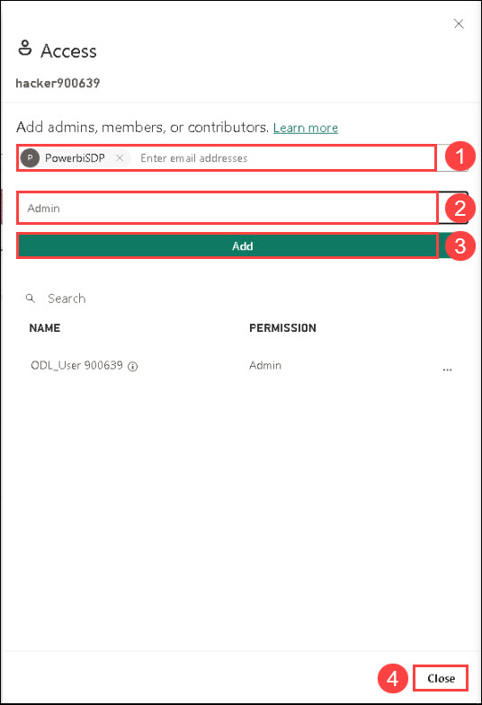  

1. In the VS Code, make sure that the **POWER BI EMBEDDED WORKSHOP_LATEST (1)** folder is open, click on the **appsettings.json (2)** to open it, replace **client id, tenant id, client secret (3)** in the line 5,6, and 10 respectively. you can find the service principal details in the **Environment details (4)** tab. 

   - Also, the **workspaceID**, **reportid**, and **datasetid** in lines 13, 14, and 15 are automatically replaced with the workspace ID, Report ID, and Dataset ID of hacker<inject key="DeploymentID" enableCopy="false" /> workspace respectively.

   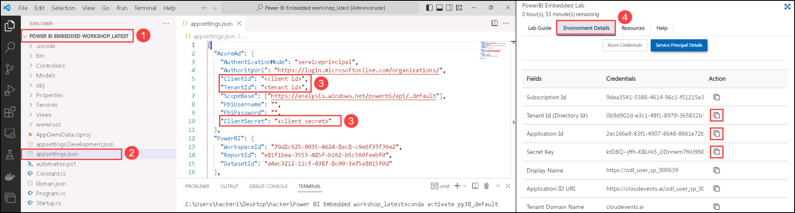

1. Click on the Terminal and type in `dotnet run` and enter to run the sample code to embed the power bi report `Wingtip Sales Analysis` in READ mode.

   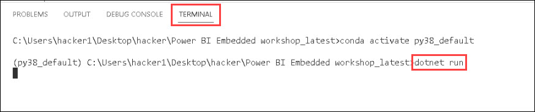

1. Once the code is executed, you can click on the link `https://localhost:5000` as shown below to 
launch the browser/app:   

   

1. Once the browser is launched, you should see a web app that has now embedded your **Wingtip Sales Analysis** report you viewed from Power BI in the earlier steps.

   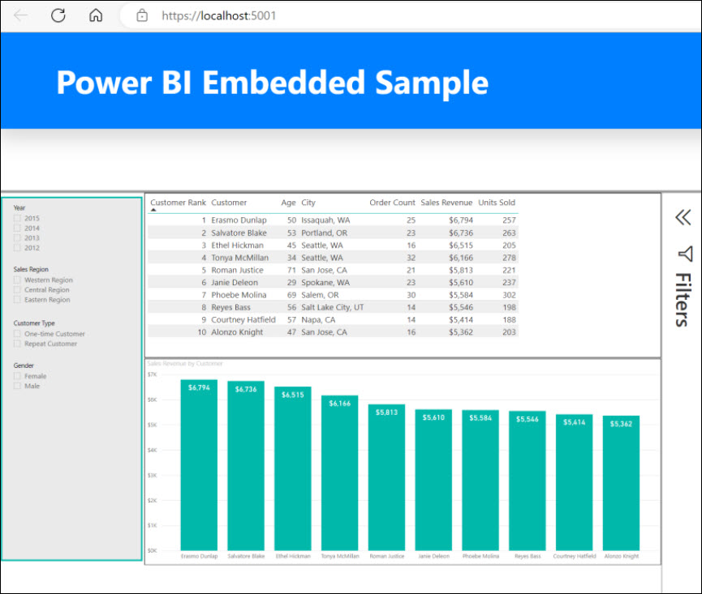

1. Navigate and explore the report and note the interactivity. Now, leave the browser open.

1. Navigate to VS Code, open `/wwwroot/js/index.js` **(1)** file. **Uncomment (2)** the WRITE MODE embedding in line #59.

   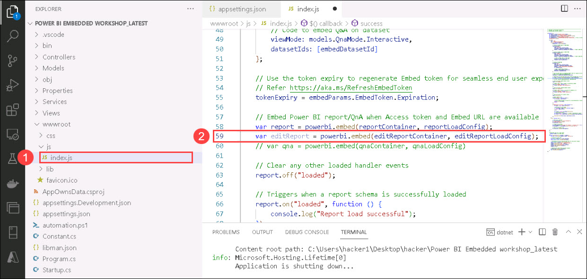

1. Save the code CTRL-S in Visual Studio Code; and refresh the web page in browser. You should 
see the same Wingtip Sales Analysis Report as a second report below the original report –
except – now you have edit/modification capabilities:

   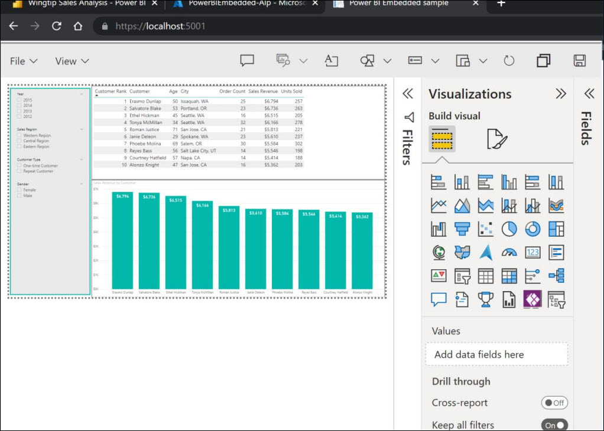

1. Perform a test update to the embedded report like, select the **chart (1)**, change the chart into **Donut chart (2)**.

   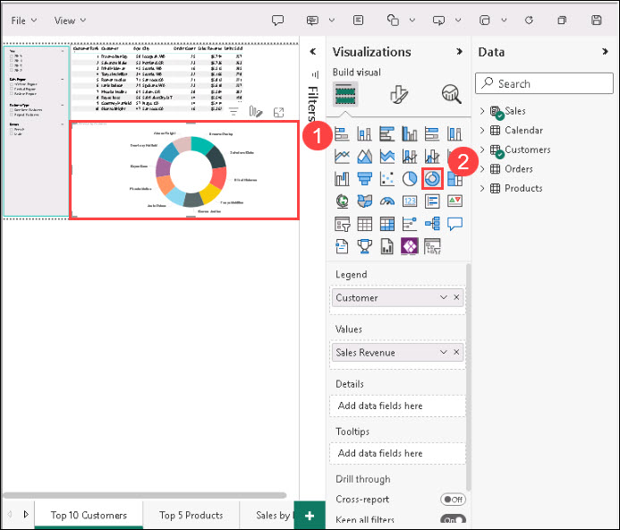

1. Click on **File (1)**, click on **Save as (2)** button, and provide the name as **Wingtip Sales Analysis updated Report (3)**, and click on **Save (4)**.   

   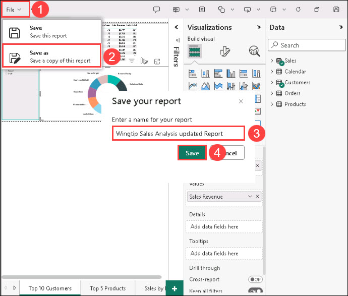

1. Now, navigate to **hacker<inject key="DeploymentID" enableCopy="false" />** workspace and you'll be to visualize the new report.

   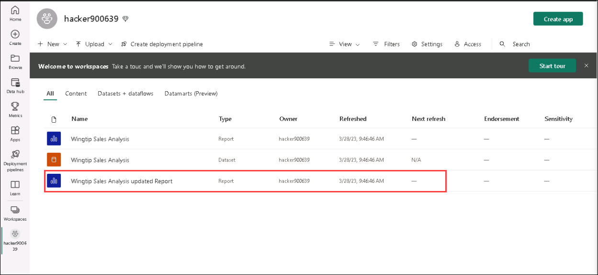

   In this module, you have learnt to embed a report in Read and Edit mode.

### Module 2: Embedding Q&A

1. Navigate back to VS Code, in `/wwwroot/js/index.js` file, the **Dataset ID** is updated already.

   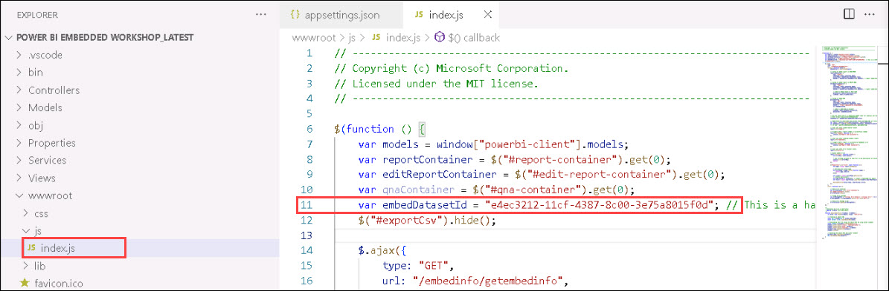

1. In the same Index.js file, **uncomment** the Q&A embed code in **line #60** to embed a Q&A visual and save the code using **CTRL-S**.

   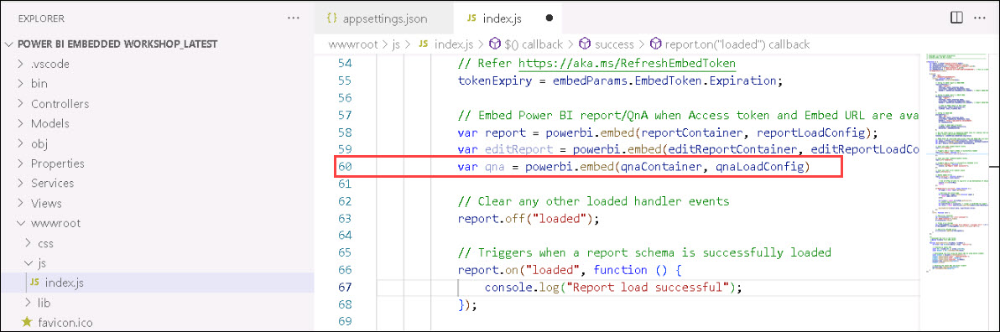   

1. Navigate back to browser and refresh the web page. click on **Ask a question (1)** button, paste **top customer states by units sold (2)** in the query box, and you'll be able visualize the results.

   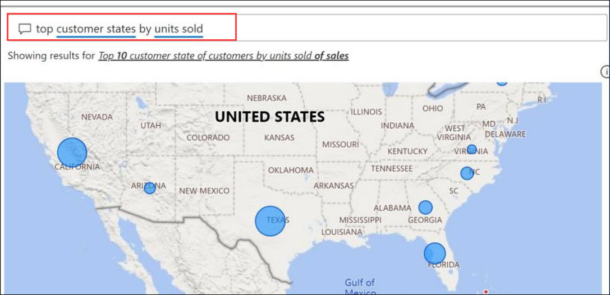

   - You can also type **top 5 customer segments by customer unit** as a custom question and check the results.

   In this module, you have learnt to embed Q&A into your web application.   

### Module 3: Export to CSV

1. Navigate back to VS Code, comment line #12 to enable the **Export to CSV** button by adding **//** in front of the export statement and save the code using **CTRL-S**.

   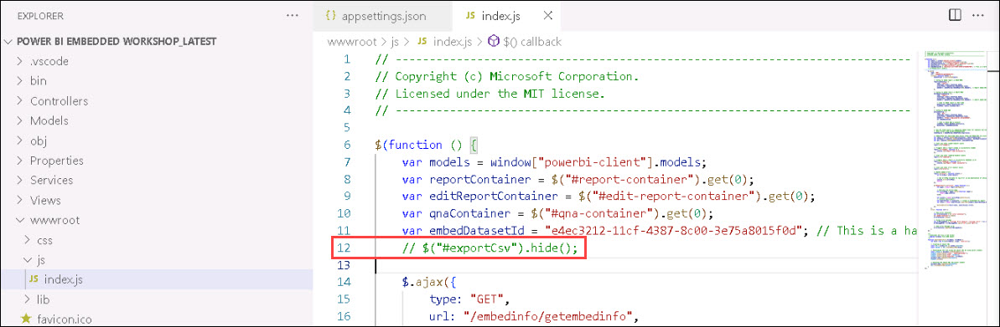

1. Navigate back to browser and refresh the web page. Click on **Export to CSV** button on the top right of the embedded report. A CSV file will get downloaded with the exported data present in it.

   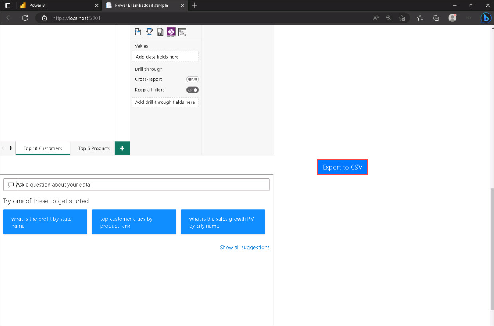

1. You can also export the data by clicking on the **ellipse (1)** button and select **Export data (2)**

   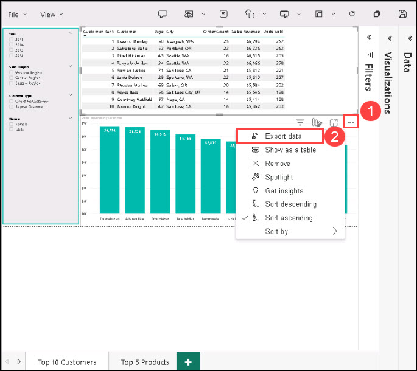   

1. in Which data do you want to export pop up, select **Summarized data (1)**, select **.csv (30,000-row max) (2)** as File format, and click on **Export (3)**. 

   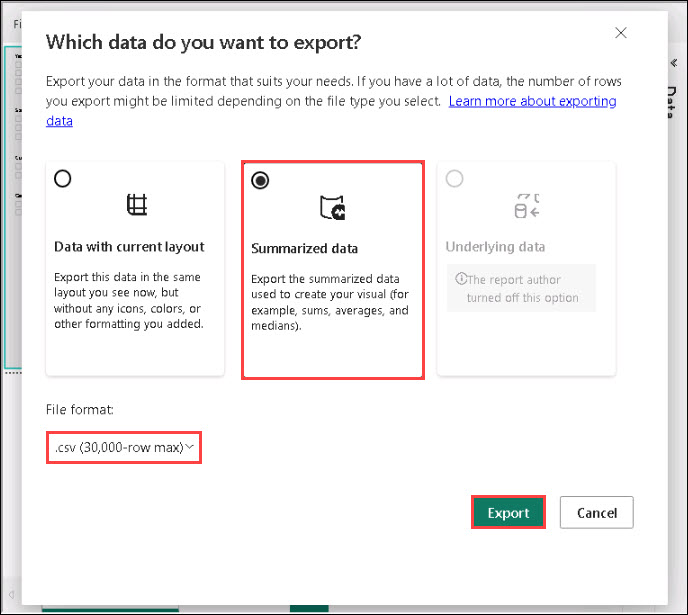

### Module 4: Embedding with RLS

In this part, we will create a role to enable row level security. In our case, we are going to apply row level security (RLS) on Internal v/s External stores so that, internal users can only see internal sales data and external users can only see external sales data.

1. From Desktop, open **File explorer (1)**, navigate to `C:\LabFiles` **(2)** directory, and open ** Sales and Returns Sample without RLS.pbix (3)** file.

   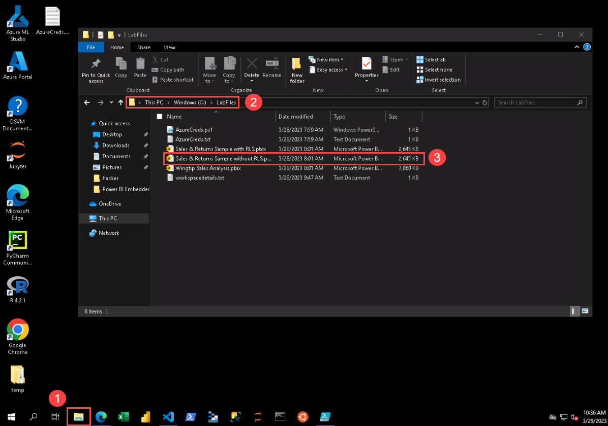

1. If Enter your email address pop up appears, Provide the **Email: <inject key="AzureAdUserEmail"></inject>** **(1)**  and click on **Continue**.

   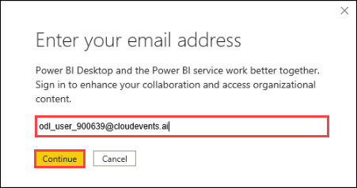   

1. 1. Now enter the following password and click on **Sign in**.
   
   * **Password**: <inject key="AzureAdUserPassword"></inject>
   
      

1. In the Power BI application, select **Modelling (1)** tab, click on **Manage roles (2)**, and click on **Create (3)** button.

   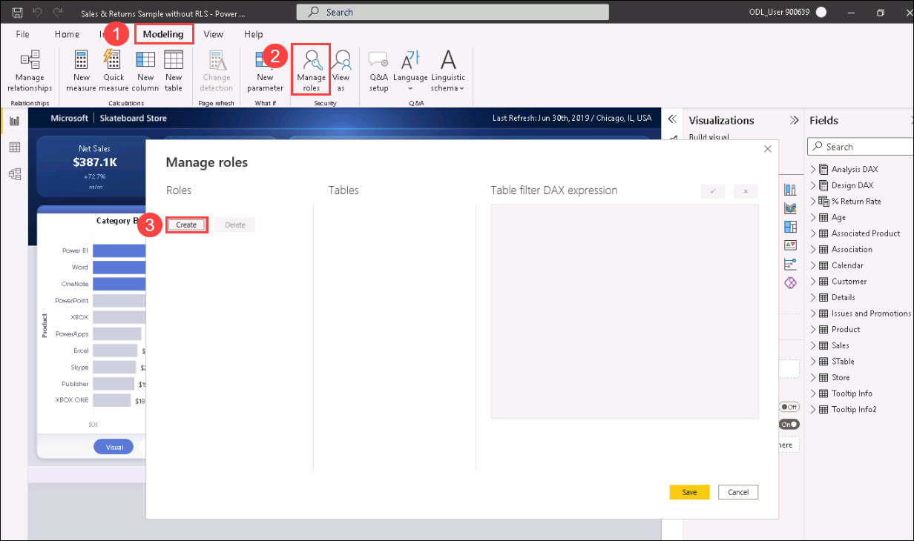

1. Follow the below mentioned steps to create role.

   - Create a role named **john (1)**.
   - Select **Store (2)** table.
   - Enter `[Store] = "External"` **(3)** in Table filter DAX expression and click on **verify (4)**. 
   - Finally, click on **Save (4)** button.

   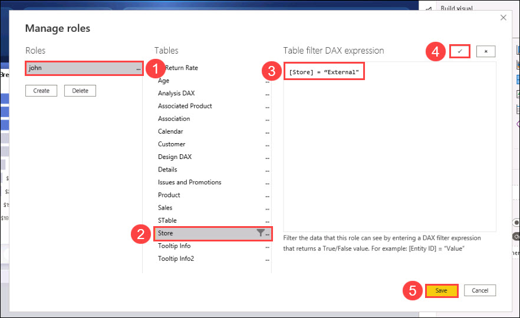

1. Click on **File** present in top left corner.

   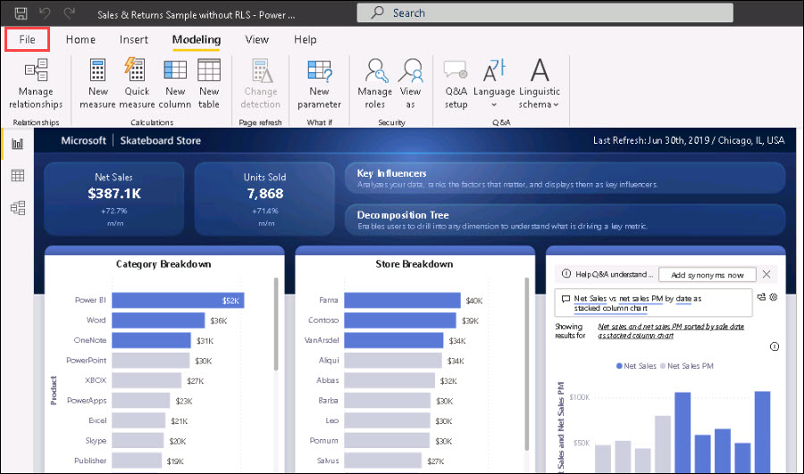

1. Click on the **Save** button to save the report.

   

1.  Click on **File** present in top left corner. Click on **publish (1)** button and select **Publish to Power BI (2)**.

    

1. Select the **hacker<inject key="DeploymentID" enableCopy="false" />** workspace and click on **Select (2)**.

   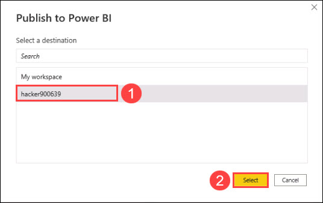

   >**Note**: Please wait until the report gets published.

   1. From the browser tab, open **hacker<inject key="DeploymentID" enableCopy="false" />** workspace and select **Sales & Returns Sample without RLS (2)** report.

   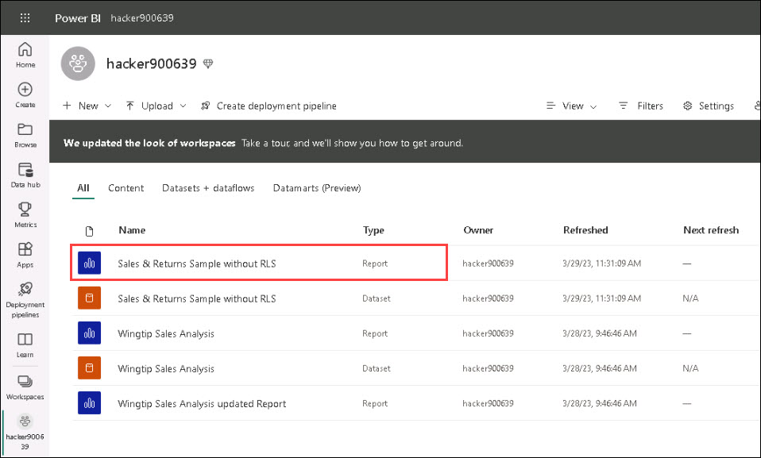   

1. Copy the **Workspace ID (1)** and **Report ID (2)** from the URL. Save it in a notepad and you'll be using the value in further steps.

   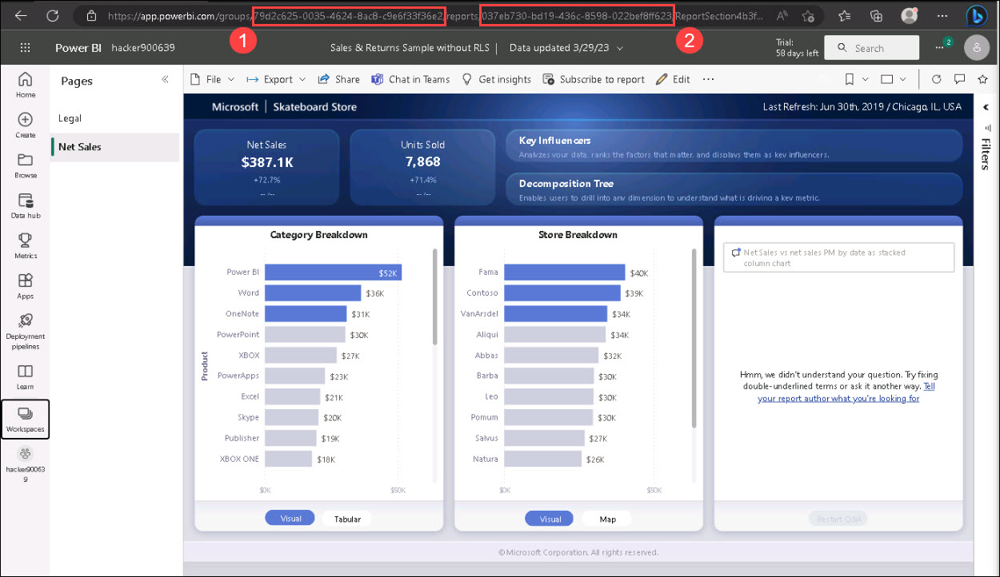 

   1. From the browser tab, open **hacker<inject key="DeploymentID" enableCopy="false" />** workspace and select **Sales & Returns Sample without RLS (2)** dataset.

   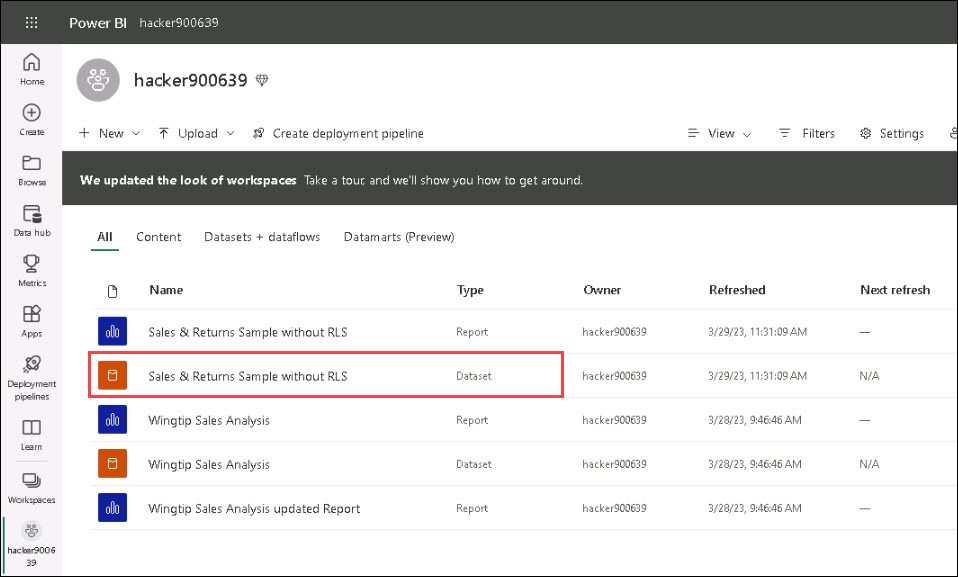   
    
1. Copy the **Datsaset ID (1)** and save it in a notepad. You'll be using the value in further steps.

       

1. Navigate back to VS Code, open `/Services/PBIEmbedService.cs` **(1)** file and **uncomment** line `#118` **(2)**.

   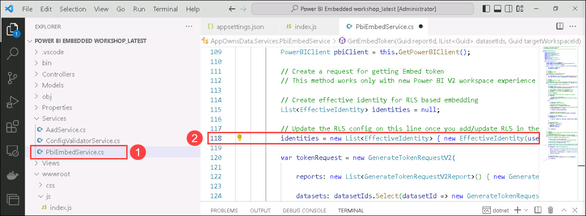 

1. Review that the Username and role values to the new role which you have created in PBI Desktop is already updated.

   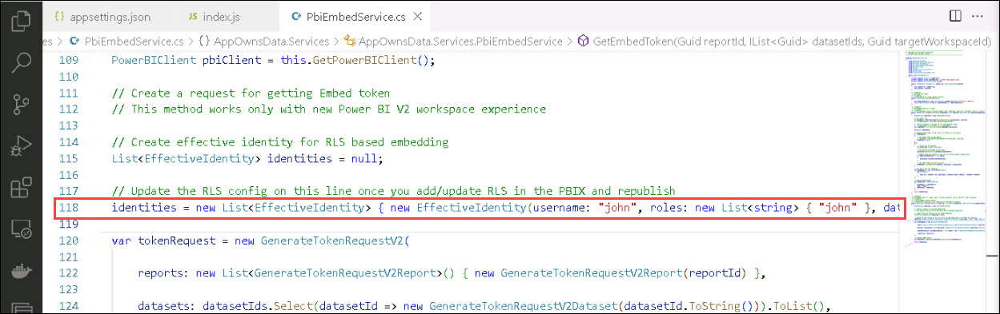 
    
1. Like in Module 1 earlier, navigate to /appsettings.json file and update the **workspace ID**, **Report ID**, and **Dataset ID** parameters to reflect the new report “Sales and Returns Sample without RLS”.

   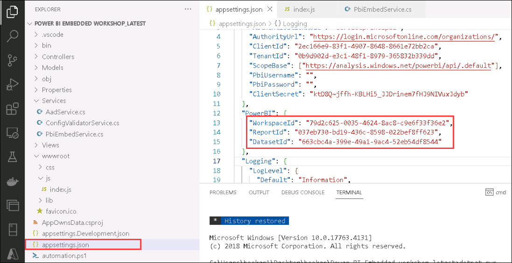 

1. Click on the Terminal and type in **dotnet run** and enter to run the sample code.

   

1. Now, you can see that the numbers in the visual are slightly on the lower side due to user (john) 
specific filtering.

1. In this module, you have learned to embed a Power BI report with data security as per user’s context.
  
